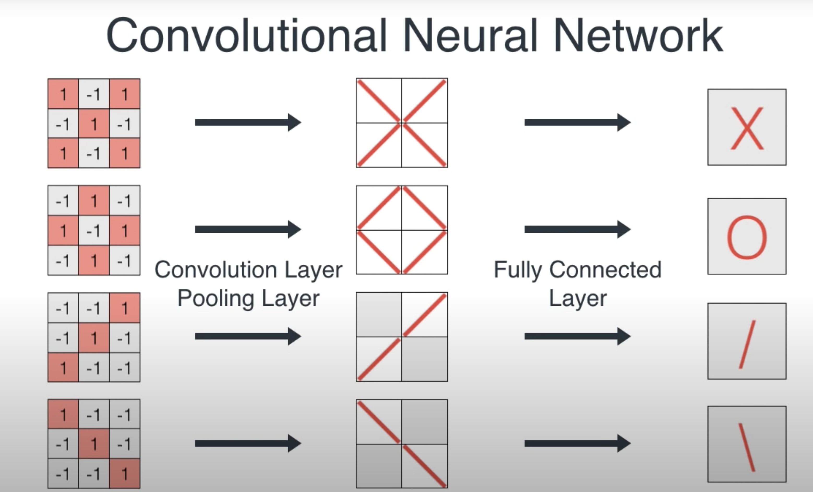
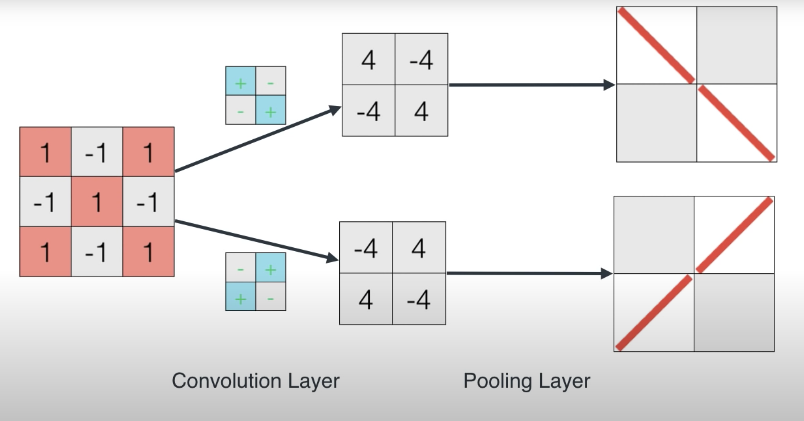
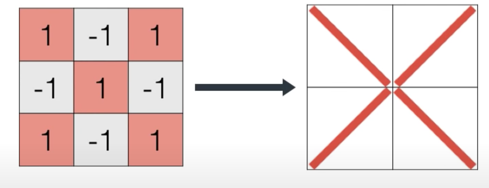

# CNN

- Conv layer + Pool layer break the image into small parts, then the following dense layer(fully connected) make descions based on those small parts the conv+pool layer detected  *https://youtu.be/2-Ol7ZB0MmU?t=775*

- A filters detect a certain thing in its size, for example if i have a 2x2 filter that detects diagonal lines and a 3x3 image, then the filter well tell me if each 2x2 chunck of the 3x3 image have a diagonal line, and we keep sliding this filter until we convered the entrie image and know where in the image we have diagonal lines
  *top is '\' filter, and bottom is '/' filter https://youtu.be/2-Ol7ZB0MmU?t=910*
 
 - The output of the conv+pool is this in the image, and if we pass that dense layer will tell us that this is an X !
   *note that the pooled img is 2x2 which is smaller than 3x3 original https://youtu.be/2-Ol7ZB0MmU?t=953*

  ### a good resource to vizualize cnn https://poloclub.github.io/cnn-explainer/#article-pooling
  