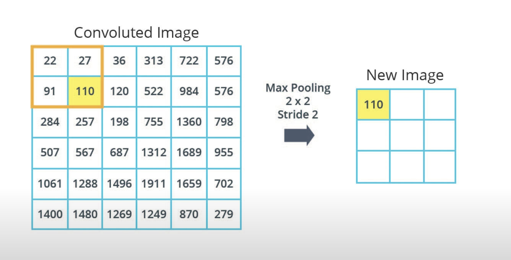
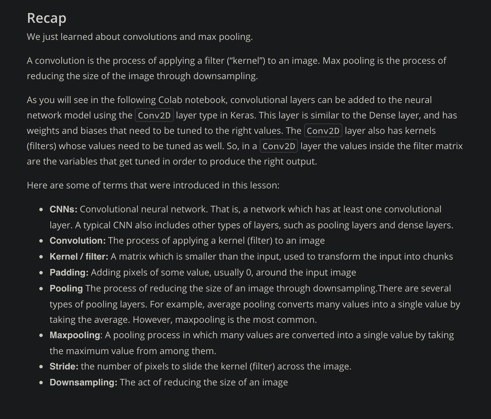
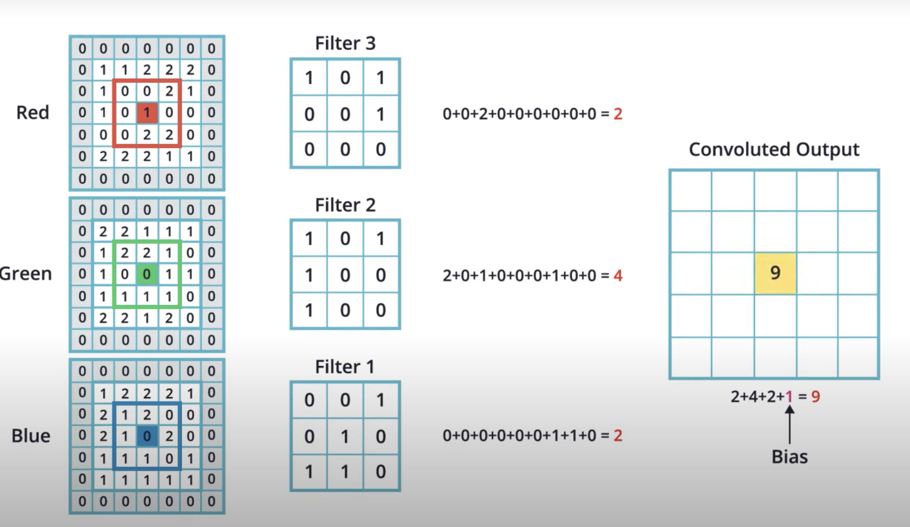
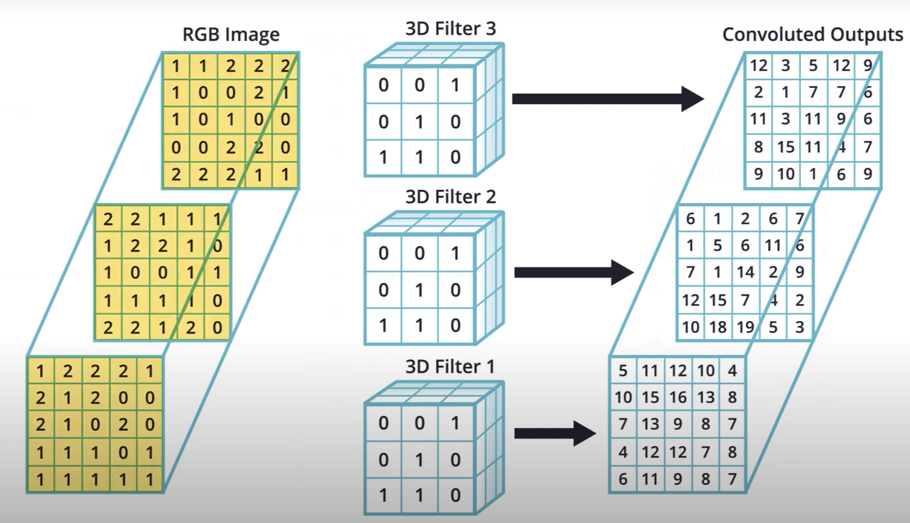
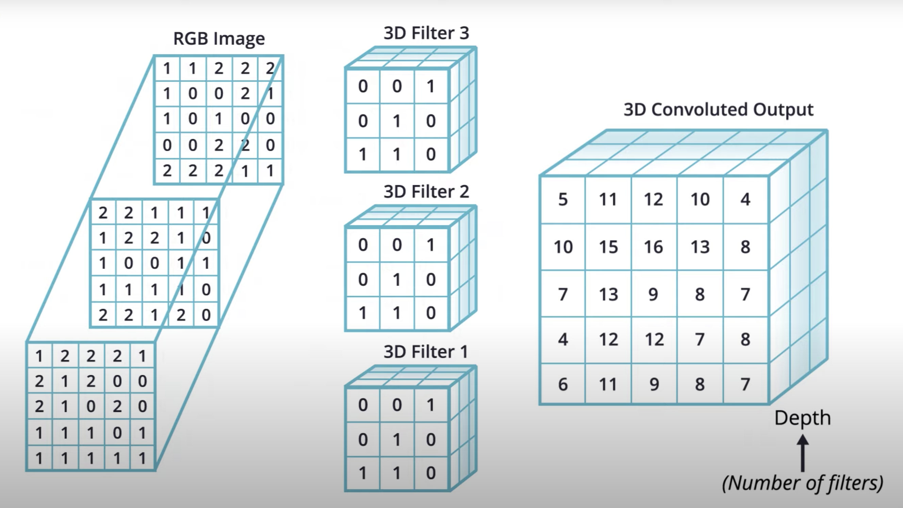
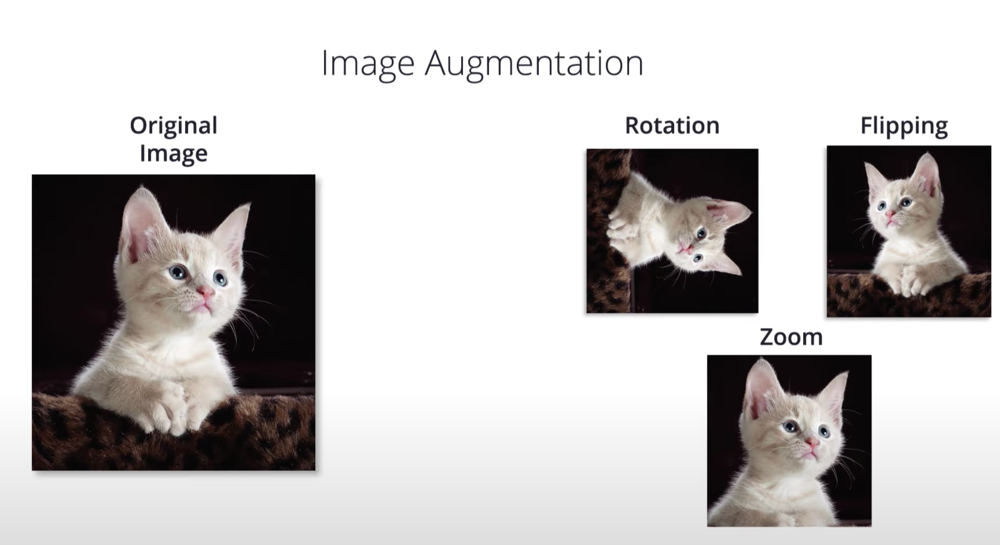
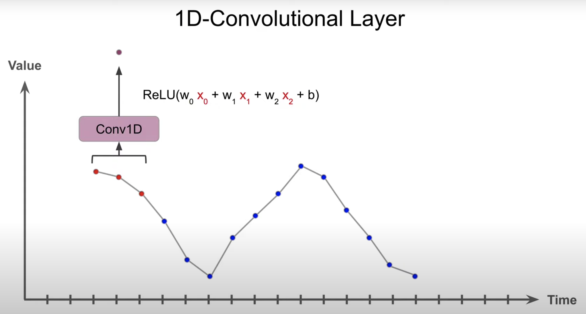
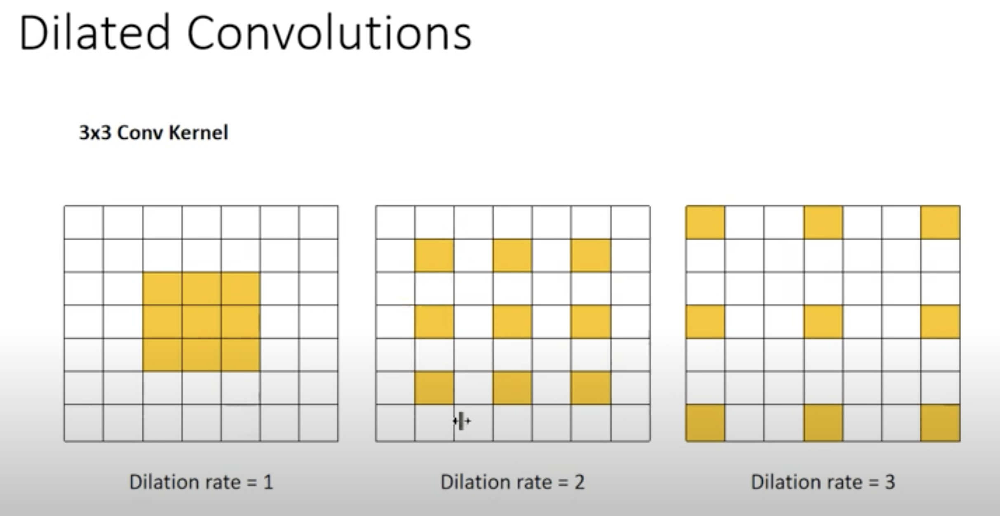
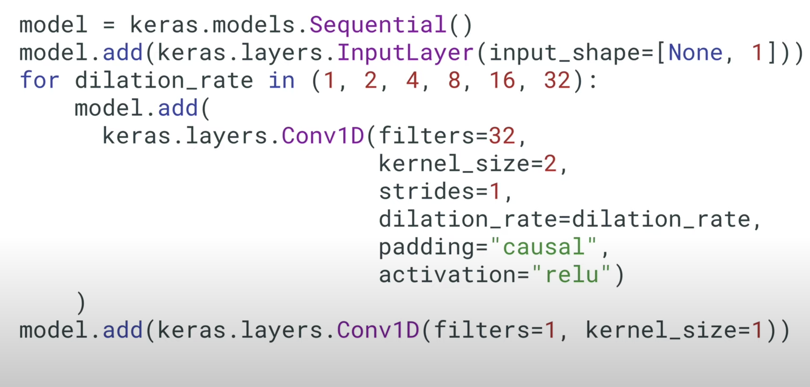

# CNN
- conv netrual net and pooling are super important in comuter vision, and CNN can replace RNN and do a better job too!
- Conv layer + Pool layer break the image into small parts, then the following dense layer(fully connected) make descions based on those small parts the conv+pool layer detected  *https://youtu.be/2-Ol7ZB0MmU?t=775*

- A filters detect a certain thing in its size, for example if i have a 2x2 filter that detects diagonal lines and a 3x3 image, then the filter well tell me if each 2x2 chunck of the 3x3 image have a diagonal line, and we keep sliding this filter until we convered the entrie image and know where in the image we have diagonal lines
  *top is '\' filter, and bottom is '/' filter https://youtu.be/2-Ol7ZB0MmU?t=910*
 
 - The output of the conv+pool is this in the image, and if we pass that dense layer will tell us that this is an X !
   *note that the pooled img is 2x2 which is smaller than 3x3 original https://youtu.be/2-Ol7ZB0MmU?t=953*

  ### a good resource to vizualize cnn https://poloclub.github.io/cnn-explainer/#article-pooling

## Maxpooling

  is when u reduce the image size based on the biggest pixel value
   *MaxPooling https://youtu.be/o_DJ-FO6dw0?t=47*

   *stride of 2x2 means that we shift 2px horizontally, when we reach the end the top of the pool-window will slide 2px down*

In here the original image is 6x6 and our pooling window is 2x2 with stride of 2 -> this means that the resulting pooled image will be 3x3

There are other types of pooling such as *Average pooling* which is when you take the average of the pooling window rather than the maximum, and there's the *Global Pooling* which is different than the two types of pooling above because it takes returns a single number, it is like setting the pooling window size to the entire image, it is a very aggressive pooling method, but it gives us a single number per image, which can be useful sometimes.

*https://classroom.udacity.com/courses/ud187/lessons/f00868fe-5974-48c4-bf36-41c0372bed64/concepts/4f7b0b45-3d43-4daa-8d6a-054cdd14abe9*

 

## Convolution operation with RGB images 

*1 3d filter(kernal) per convoluted output https://youtu.be/iDH3LCZwL5M?t=265*

*it is 1 image, and we apply many 3d filters on it, for each filter we get one 2d convoluted output (filtered image). Now after all filters are done we get the num of convoluted is images equal to the number of filtes used. We take all of those covoluted outputs and put them into one matrix(tensor) with depth equal to num_of_filters https://youtu.be/iDH3LCZwL5M?t=269*

### Oh btw the values in the filters(kernal)are random at first and get "trained" to produce the smallest possible error function

## Fighting Overfitting!

- Using Image augmentation we apply random transformations on the training images so our model sees more variation during training, maybe random zoom, random tilts and so on
  *Image augmentaion examples https://youtu.be/Qgd7maIVytI?t=115*

- ### *DropOuts* A great way to help with reduce overfitting. Is when we turn off neurons during training, so other neurons can contrinute more
  
### 1D conv net and Time series forecasting

- 1D conv net slide the filter throu a list rather than through an image matrix(conv 2d) which makes them great for analyzing series and time forcasting
- *https://youtu.be/CG2V--A7Ebk?t=79*
- We can use causal padding to add the padding at the beginning so that outputs at time t depend on inputs at time t. rather than using "same" padding which may cause the output at t to depend on input after time t. So for Forecasting it is important to use *Causel padding* In otherwords, Causel padding prevents the model form peaking into the future.

### Dialted Convolution

These introduce holes in a CNN filter to get more coverage, a standared  3*3 keranal (filter) has a dilation of 1. The more we increase dialtion the more "separate" the filter is
*https://youtu.be/0Lg_V0Um-1Q?t=84*
- Usage:
  - Dialted convs are used in WaveNet architecture (Text to speech)
  - are good of sequences of input (time series like audio, text ...etc)
- Why?
  - it gives a global view of the data piece, but with less parameters
  - Boarder view, like bird eye view, so u see the bigger picture but with less details
  - more efficient
- In WaveNet the had dialtion the keeps doubling for their time series , a dilation of 2 means that you skip every other time step https://youtu.be/VSU33wFHb0o?t=18, Dilation of 4 means that you skip 3 time steps out of 4.
  - *A WaveNet like architecture, made of 6 convoltinoal layers with growing dialation and the final conv layer with filter 1 and stride 1 is equal to a dense layer https://youtu.be/VSU33wFHb0o?t=100*

## Extra refs
- a guide on cnn https://towardsdatascience.com/a-comprehensive-guide-to-convolutional-neural-networks-the-eli5-way-3bd2b1164a53
- ways to reduce overfitting https://hackernoon.com/memorizing-is-not-learning-6-tricks-to-prevent-overfitting-in-machine-learning-820b091dc42