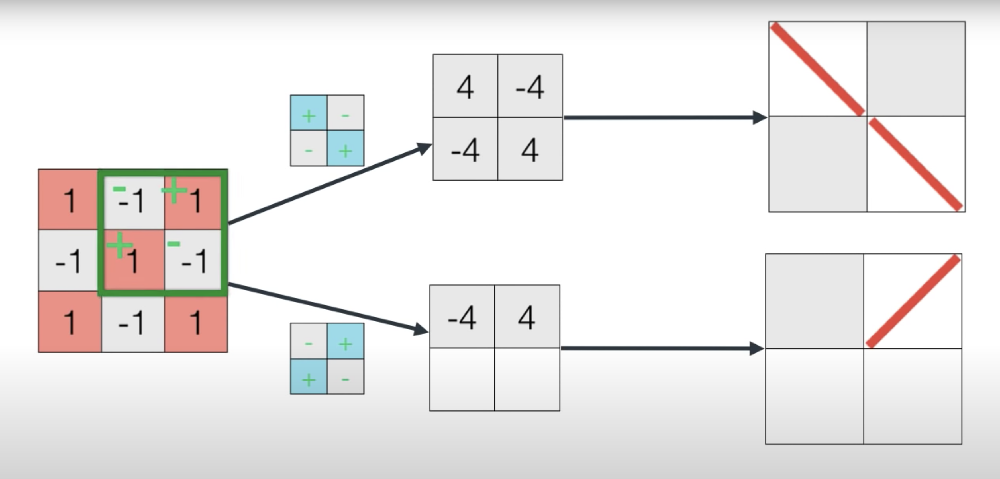
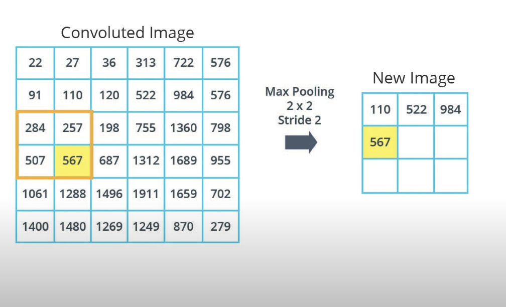
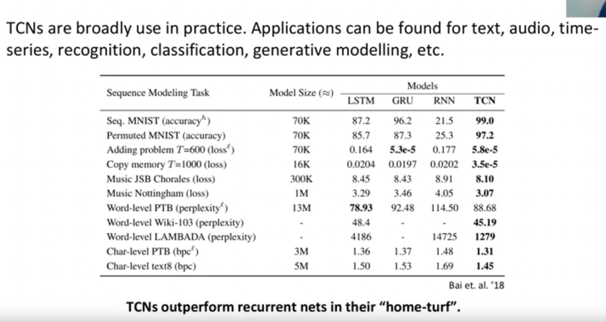

# CNN Notes

2D Convolution is usually used to extract features from an image and put them into num_of_filters dimensions while scaling the image down, for example if I have 6x6 RGB image (3 channels R, G, B) so input of shape 6x6x3 and I use a conv layer with 64 filters and stride of 2 the output will be of shape 3x3x64, ie the output got reduced in x,y but increased in the filter dimension. 

- a great resource to visualize hyperparameters of conv layer (scroll down to "Understanding Hyperparameters" section) https://poloclub.github.io/cnn-explainer/
- CNN output shape depends on the number of filters, filter size (kernel size), strides, and padding
- Conv layer ouutput can be sampled down with either stride size or the pooling layer
  The conv will learn what values or "weights" for the filters and the size output of the conv will depend on the stride and padding used. You can further reduce the image using a Pooling layer.
- Pooling layers help control overfitting as it gets rid of data that can be too specific, it has it's own stride parameter than can be used to further sample the cnn output if the pooling layer directly follows (note that there are not learned params in the pooling layer).
- Usually in classification problems Conv layer + Pool layer break the image into small parts, then a following dense layer(fully connected) make decisions based on those small parts the conv+pool layer detected  *https://youtu.be/2-Ol7ZB0MmU?t=775*

- A filters detect a certain thing in its size, for example if i have a 2x2 filter that detects diagonal lines and a 3x3 image, then the filter well tell me if each 2x2 chunck of the 3x3 image have a diagonal line, and we keep sliding this filter until we convered the entrie image and know where in the image we have diagonal lines
  *top is '\' filter, and bottom is '/' filter https://youtu.be/2-Ol7ZB0MmU?t=910*
 
 - The output of the conv+pool is this in the image, and if we pass that dense layer will tell us that this is an X !
   *note that the pooled img is 2x2 which is smaller than 3x3 original https://youtu.be/2-Ol7ZB0MmU?t=953*

## Maxpooling

  is when u reduce the image size based on the biggest pixel value
   *MaxPooling https://youtu.be/o_DJ-FO6dw0?t=47*

   *stride of 2x2 means that we shift 2px horizontally, when we reach the end the top of the pool-window will slide 2px down*

In here the original image is 6x6 and our pooling window is 2x2 with stride of 2 -> this means that the resulting pooled image will be 3x3

There are other types of pooling such as *Average pooling* which is when you take the average of the pooling window rather than the maximum, and there's the *Global Pooling* which is different than the two types of pooling above because it takes returns a single number, it is like setting the pooling window size to the entire image, it is a very aggressive pooling method, but it gives us a single number per image, which can be useful sometimes.

*https://classroom.udacity.com/courses/ud187/lessons/f00868fe-5974-48c4-bf36-41c0372bed64/concepts/4f7b0b45-3d43-4daa-8d6a-054cdd14abe9*

 

## Convolution operation with RGB images 

*1 3d filter(kernal) per convoluted output https://youtu.be/iDH3LCZwL5M?t=265*

*it is 1 image, and we apply many 3d filters on it, for each filter we get one 2d convoluted output (filtered image). Now after all filters are done we get the num of convoluted is images equal to the number of filtes used. We take all of those covoluted outputs and put them into one matrix(tensor) with depth equal to num_of_filters https://youtu.be/iDH3LCZwL5M?t=269*

### Oh btw the values in the filters(kernal)are random at first and get "trained" to produce the smallest possible error function

## Fighting Overfitting!

- Using Image augmentation we apply random transformations on the training images so our model sees more variation during training, maybe random zoom, random tilts and so on
  *Image augmentation examples https://youtu.be/Qgd7maIVytI?t=115*

- ### *DropOuts* A great way to help with reduce overfitting. Is when we turn off neurons during training, so other neurons can contribute more
  
### 1D conv net and Time series forecasting

- 1D conv net slide the filter throu a list rather than through an image matrix(conv 2d) which makes them great for analyzing series and time forcasting
- *https://youtu.be/CG2V--A7Ebk?t=79*
- We can use causal padding to add the padding at the beginning so that outputs at time t depend on inputs at time t. rather than using "same" padding which may cause the output at t to depend on input after time t. So for Forecasting it is important to use *Causal padding* In otherwords, Causel padding prevents the model form peaking into the future.

### Dialted Convolution

These introduce holes in a CNN filter to get more coverage, a standard  3*3 keranal (filter) has a dilation of 1. The more we increase dialtion the more "separate" the filter is
*https://youtu.be/0Lg_V0Um-1Q?t=84*
- Usage:
  - Dialted convs are used in WaveNet architecture (Text to speech)
  - are good of sequences of input (time series like audio, text ...etc)
- Why?
  - it gives a global view of the data piece, but with less parameters
  - Boarder view, like bird eye view, so u see the bigger picture but with less details
  - more efficient
- In WaveNet the had dialtion the keeps doubling for their time series , a dilation of 2 means that you skip every other time step https://youtu.be/VSU33wFHb0o?t=18, Dilation of 4 means that you skip 3 time steps out of 4.
  - *A WaveNet like architecture, made of 6 convoltinoal layers with growing dialation and the final conv layer with filter 1 and stride 1 is equal to a dense layer https://youtu.be/VSU33wFHb0o?t=100*

 

# De-convolution, ConvTranspose, AntiConvolution
2D Convolution is usually used to extract features from an image and put them into num_of_filters dimensions while scaling the image down, for example if I have 6x6 RGB image (3 channels R, G, B) so input of shape 6x6x3 and I use a conv layer with 64 filters and stride of 2 the output will be of shape 3x3x64, ie the output 2d dimensions got halved because of the 2x2 stride. In the ConvTranspose operation the opposite happens and instead the output 2D dims will be doubled instead of halved, in other words we are creating new data, this is useful when we want to re-create an image or upsample it. The convtranspose layer will have learned weights that will optimize the upsampling of the image.

If you use a filter of 1, and stride of 1 on this 4x4 image, nothing will happen 

However, if you use a stride 2x2 you will notice that it is not going to work, since we don't have enough "image" to do the stride, so the transpose-conv2d layer will create zeros for us so we're able to stride. Thus expanding the image.

images source: https://www.coursera.org/learn/generative-deep-learning-with-tensorflow/lecture/DszLn/face-generator

 

# Convolution for Sequential data - Causal Con - Temporal Convolution Network
CNNs outperform RNNs in sequential data learning (like time series) of course there are always trade offs between using an RNN vs a CNN, but the CNN avoid the exploding and vanishing gradient problems in RNNs. CNNs are also faster to train.

Causal Convolution with Dialation can be used to read ordered sequences (speech for example). They do suffer from the receptive field problem (how many datapoints can I observe at a given moment) a solution to this is to use stacks of dialated conv layers with different layers each has an increasing dialation factor this is called Temporal Convolution Network (TCN). The pros is that it can look at early points in the input data, cons is that it can suffer if there's a segment of "silence" in the data, as that will be calculated in the weights training if no counter measures are implemented.

WavNet is based on a TCN

good lecture about it : https://www.youtube.com/watch?v=rT77lBfAZm4

 

# Cool stuff with Convs

### Various size images in CNN
 RetinaNet can have various size input image because it has 1D convolutional  layers that flatten the input. Because  of this RetinaNet can accept ANY size input image!!.
- *1D conv layers can be used as Flatten Layers* and the advantage is that you control the number of filters, ie the depth of the layer, therefore, the shape will be 1x1xnum_filters and that's something you control so you can have any size input. look at this github issue that talks about this https://github.com/fizyr/keras-retinanet/issues/341
- CNN can replace RNN and do a better job too!

## Extra refs
- a guide on cnn https://towardsdatascience.com/a-comprehensive-guide-to-convolutional-neural-networks-the-eli5-way-3bd2b1164a53
- ways to reduce overfitting https://hackernoon.com/memorizing-is-not-learning-6-tricks-to-prevent-overfitting-in-machine-learning-820b091dc42