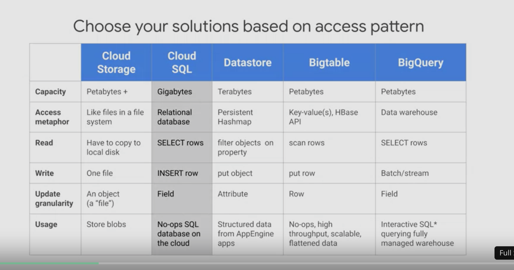
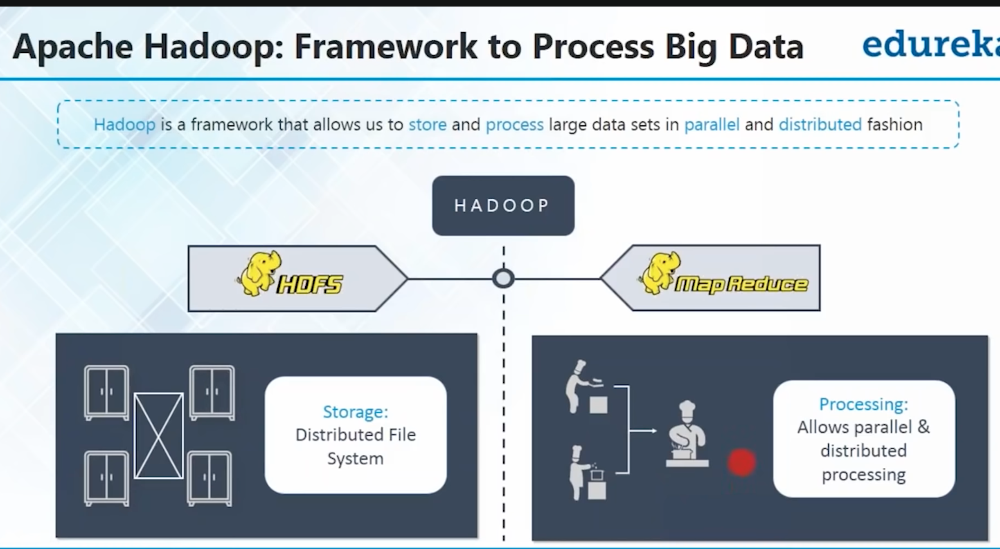

Course 1 intro do GCP

https://www.coursera.org/learn/gcp-big-data-ml-fundamentals/lecture/RJDJP/introduction-to-google-cloud-platform

GCP offers under compute:
	1. compute engine: ability to run VMs on google servers
	2. Google kubernetes engine (GKE)= cluseters running containers
	3. app engine: run code in the cloud without setting up infrastructure (ie use command line) long lived web app that can scale
	4. Cloud functions: serverless code execution that gets triggered by events
	5. 

You can setup a database in compute engine. or use GCP db services

GCP storage offers thses services
 

If all your friends drive SUVs and you were reading an article about Honda. ML recommendation system might suggest to you a Honda SUV eeven though you only searched honda and never an SUV
this is because the ML tries to see "who are you like" and finds your "personality" from the people around you or the people who have other data trends

Bigtable is good for high throughput, like senesor data maybe gps, imu...etc

cloudSQL is on database, but if you need to scale to multiple DBs use cloud scanner

useful commnad to open a UI for the file system in GCP from the cmd line `cloudshell edit train_and_apply.py`

with Apache spark you can train several machine learning models in parallel to find the best hyper parameters. such as learning rate and number of neurons
The higher the num of nuerons the more sensitive your model is to the learning rate, simpler models tend to be good enough, but if you will go hunting for that extra 1% then be willing to invest a lot of computing resources https://databricks.com/blog/2016/01/25/deep-learning-with-apache-spark-and-tensorflow.html

in bigQuery sql, the backticks `` are used for when your table name has hypens "dashes"

ML can be used for ecomnomic forcast, by seeing containers in the sea you can predict the golbal economic movement by monitering the cargo by satalite imagery, your forcast you can be ahead by days of months ahead of the official "release"

To train your own models you need around 100K records of data or examples, but it depends, because if you use their apis you become vendor locked in to google

1. you can use Google's prebuilt machinelearning APIs, like computer vision, video intellegence, speech to text ...etc you can even use it inside google sheets.
Google vision api can detect theses things, for facial detection, it can detect basic emotianl expression

2. autoML helps you build models without code, helps you extend the existing google ML apis. For example if vision api can tell you if it's a cat or dog, but can't tell you which type of cat or dog
   autoML lets you upload your labeld images and it handles the rest for you, it creates many different models and pits them against each other to produce the best model
   
   
   
   This is called __This NAS net approach or neural architecture search__
https://iclr.cc/virtual/2021/workshop/2145
https://sites.google.com/view/nas2021/home

I can use autoML (automatic machine learning) to train a really good model then download it for use on edge devices

3. Make your own ML models using ML engine Notebooks (iPython)

---