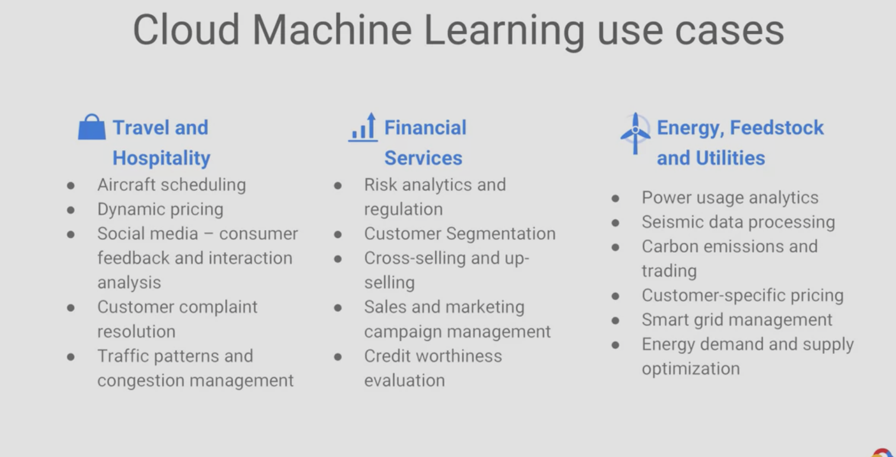

# How Google does Machine Learning

https://www.coursera.org/learn/google-machine-learning/home/welcome

A model solves a specific problem. The model that predicts when you have to restock electronics is different from the model that tells you when to restock furniture

simple models trained on large datasets perform better than complex models triained on small datasets, so data is the most important thing in ML.

allows us to detect skews in the dataset

- Compute engine is a cloud distributed cpu and cloud storage is a cloud distriuted disk.
- However datalab is a single node program so it runs on a single compute engine instance
- 