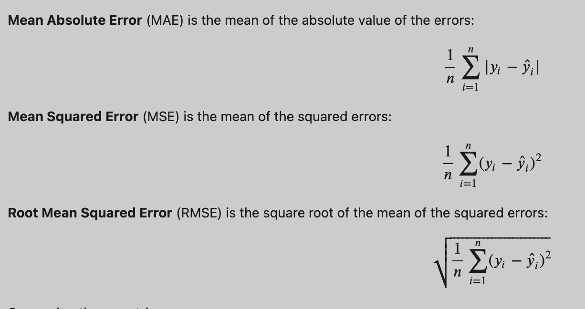
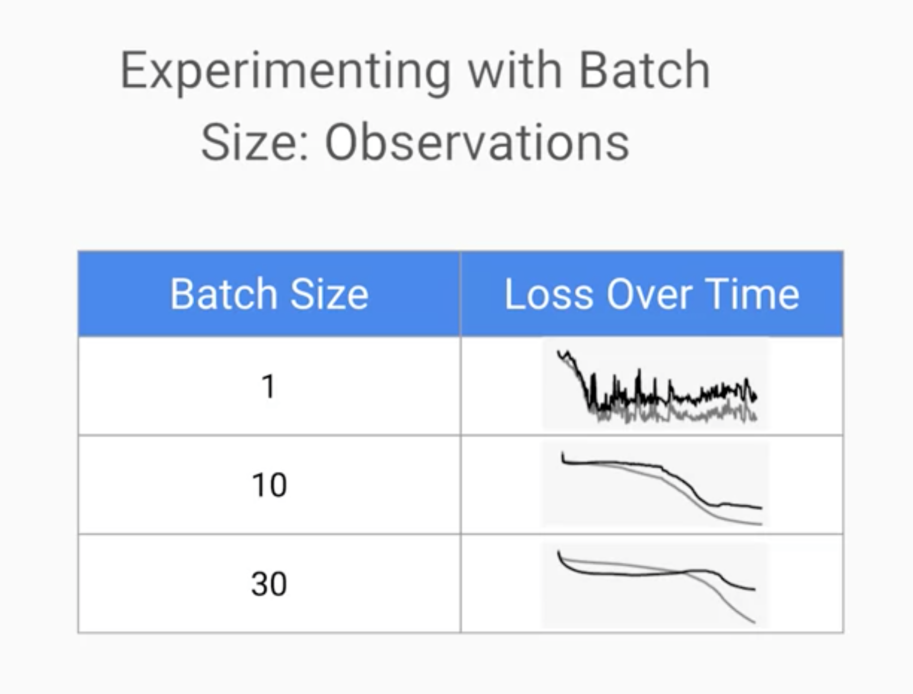

# Launch into ML
https://www.coursera.org/learn/launching-machine-learning#syllabus

you can convert a regresstion problem to a catagoriacal problem by creating "bins" to house the data, ie if tips is less than 5$ it's type 1 if it is more than 5$ and less than 10$ its type B . and so on

you can also convert a catagorical problem into a regression problem it all depends on the problme you're trying to solve

- Decision trees can be used for both linear regresstion and classification problems

We can find the weights of our linear model with analtyical methods, but because this doesn't scale to huge datasets we use gradient decent

the stepper the slope the bigger the step wwe have to take.

either find better features or make a more complicated model.

In the first plot the learning rate is too high, in the second its too low 

Here it is just right, we get an error drop and it statys low 

The difference between lienar models and neural networks is the activation function. when activation func is linear it is a linear model.

hidden layers and num of neruons per layers affect training

when we train the model on a single data point, the weights update based on that point (update per point). But if we use a batch the model weights updates based on all the data points in the batch (update per batch).
Batch training smoothes the loss curve and reduces the data noise, since noise from a single data point drowns in the signal of the batch.

For confusion Matrix

precision is true postives / total classified as positives in other words it is like saying out of the predections you made how many were correct? 
precision = truePositive/(True postive + false postive)

Recall is true_postives / all_actual_positives_in_the_data ie Recall = TF/(TF+FN)

a recall of 100% means that you found all or identified all cats as cats, but it could mean that you idetified everthing as a cat even what's not a cat and that's why you got high recall. so recall rewards match finding and doesn't punish false postives
Re

you can use bootstarping aka cross validation when you dont have a lot of data

 a way to split your data into test, validate, test

When u do hyper parameter tunning wanna make sure you always use the same train and validation data, so that you know if your model imporved because of the parameters not because the new data is easier

The split has to be consistantm should always change.

hardcoding datasplit is no good either because if your data grows or shrinks your split will not cover the new data properly. What you should do is use a percentage or split based on a column hash