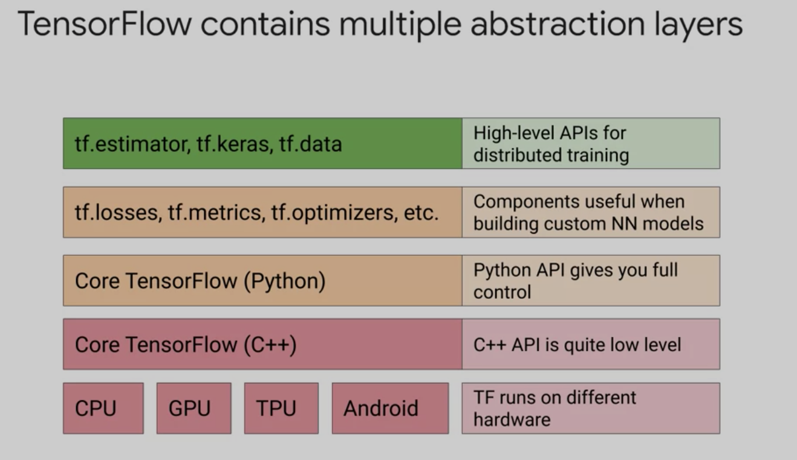
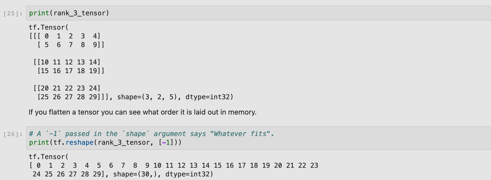
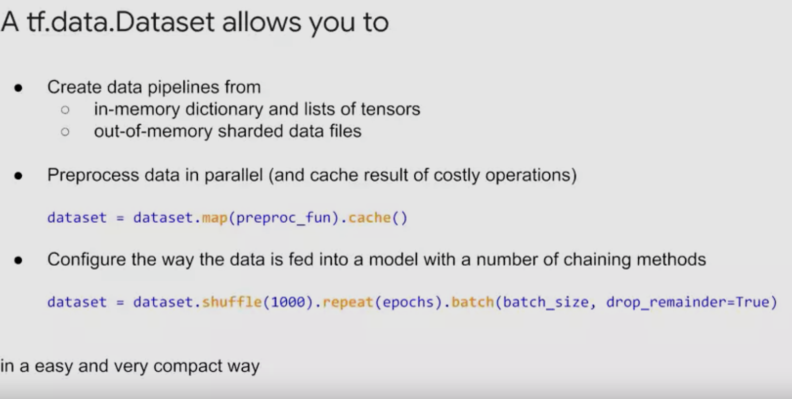
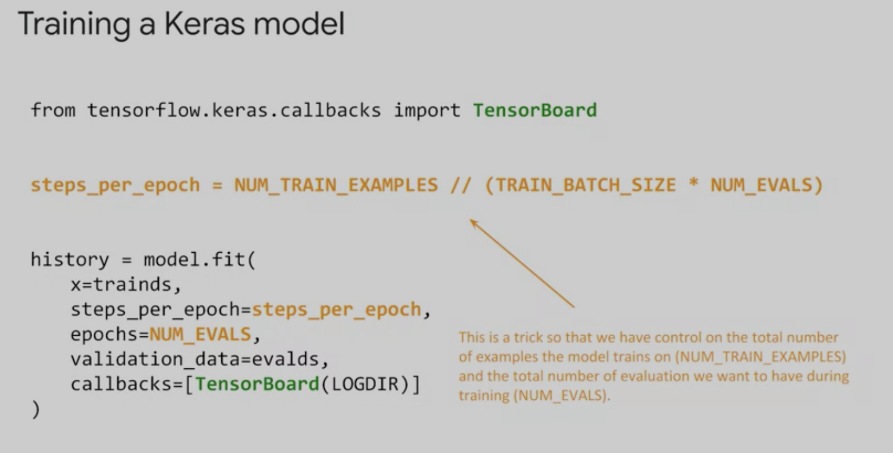
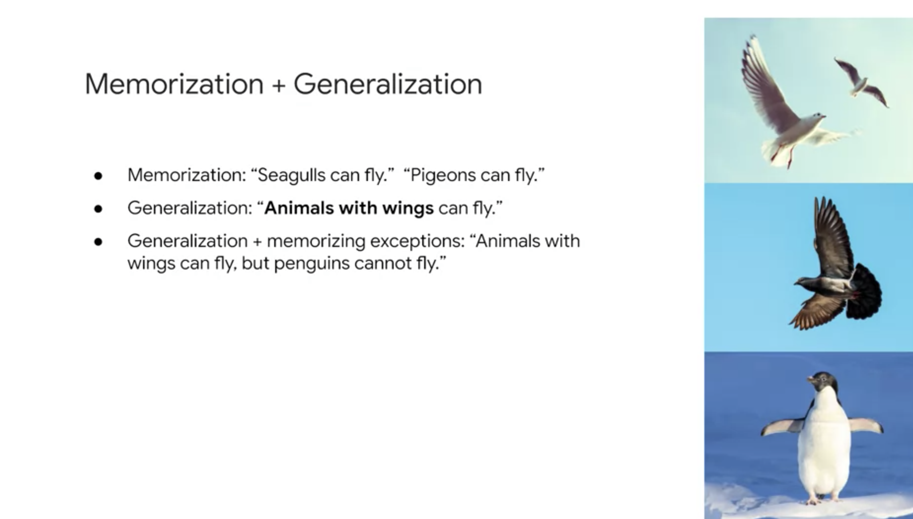

# Course 4 intro to tensorflow
https://www.coursera.org/learn/intro-tensorflow/lecture/t6nP6/intro-to-course

tensorflow is a numerical computation lib so can be used instead of matlab or numpy to do GPU computing, aha so useful. U can use it to solve partial diffintial equations

TF uses directed graphs to represent computations called Directed Acyclic Graph aka DAGs. TF uses DAGs because the DAG is languague independant of the code and can be portable between different devices, meaning you write your DAG in python and store it in a saved model restore in C++ for low latency which can run on both GPU and CPU.

This is very similar to how Java and JVM (java virtual machine ) work. You write your code in a high level langaague (Java) and then your java code can be executed anywhere by the JVM. The JVM is OS specific and can talk to the hardware,usually software devs only have to know Java and for the JVM it is already made. In tensorflow you write your code in a highlevel langauge (Python) and the code is executed by the tensorflow runtime engine.

In TensorFlow, tensors are multi-dimensional arrays with a uniform type (called a dtype).  All tensors are immutable like Python numbers and strings: you can never update the contents of a tensor, only create a new one.  

 
from the lab find training-data-analyst > courses > machine_learning > deepdive2 > introduction_to_tensorflow > labs, and open tensors-variables.ipynb. at `git clone https://github.com/GoogleCloudPlatform/training-data-analyst`

there are shortcuts for matrix multiplication and operation a @ b is matmul, a*b is dot product 

 

##  About Axis

rank 1 tensor has 1 axis and rank 2 tensor has 2 axes and so on, axis means "diminsion" or how many nested arrays we have BUT axes doesnt mean rank, if the shape is (2,3,3)then each of the "2,3,4" is an axis.

## About shapes

 

## Broadcasting

 nicer view

## Ragged tensor

## Variables

Onehot encoding is not scaleable to huge datasets, that's why we use embedded columns, where one cell can have the "one hot encoding" instead of having it be whole columns

 

which is super useful

`tf.feature_column` a feature column provides methods for the input data to be properly transformed before sending it to a model for training. Again the model just wants to work with numbers, that's the tensors part.

followed along the code and made this notebook tensorflow_feature_col.ipynb

TF.data api allows you to build complex data pipeline and preprocessing, tf.data makes it possible to use in and out of memory files and process data in parallet  and even cache data.

There are two ways to make a dataset.
	1. A datasource makes the dataset from data in memory
	2. a dataset from multiple tf.dataset objects. 
   Large datasets tend to be broken down into multiple files.

   there are specccialized dataset types
   1. TextLineDataset to make a dataset that uses textfiles
   2. TFRecordDataset uses TFRecord files
   3. FixedlengthRecordDataset uses a dataset from fixedlength record or binary files
   4. anything else use the generic dataset class and add your own encoding decoding

you can use TFRecord and TFexample which are protobuffers, as well as the data api to create input piptlines

To explore the data tensorflow offers Facets and Tf data validation https://www.tensorflow.org/tfx/data_validation/get_started

A good resource for a lot of things AI.

---

Both of these models are linear, in fact the more complex one is EXACTLY the same linear model even though there's a hidden layer of neruons  

Even this one is still the same and it is linear  

No matter how many hidden layers we add the model will always stay linear, all the hidden layers can collapse into a single layer becuase it will be a linear combination, this is because whhat the hidden layers is add matrix multiplication and addition which are linear operations.

To make nonlinear models you add non-linear activation functions!!

Training with Relu is faster than most other activation functions, but Relu suffers from zero negative domain problem. Signmoid doesn't have that problem but it has the vanishing gradiant problem.

There are many variations of relu that helps us combat the negative zero domain problem. (ie if the grad is negatibve it will be zero causeing the weight to be zero and there will be a lot of zeros in the layer making it fail to train as the weights will not update and will go to zero)

Batch normalization can help spped up trainng times and solve innternal coveriance shift( how the signal changes as data goes through the network)

### Keras

- A sequential model is a convieniant way to create a stack of layers, where you have one input tensor and one output tensor. It is not good for things with multiple inputs and outputs, or a layer can have multiple inputs/outputs, there is layer sharing, or the model has a non linear topology (ie the model isnot just a stack of layers such as residual connection or multibranch)

- The more layers the more "patterns" your model can learn, but watch out because the more layers can also increase the likelyhood of overfitting as you might memorize all the patterns of the train dataset.

- adam and ftrl are good goto optimmizers
- 
- 
- The .fit() function works well for small datasets which can fit entirely in memory. However, for large datasets (or if you need to manipulate the training data on the fly via data augmentation, etc) you will need to use .fit_generator() instead. The .train_on_batch() method is for more fine-grained control over training and accepts only a single batch of data.

rnn cant be done in functional api

usually a dropoff probability of between 20 to 50% is good.

The Wide part of the model is associated with the memory element. In this case, we train a linear model with a wide set of crossed features and learn the correlation of this related data with the assigned label. The Deep part of the model is associated with the generalization element where we use embedding vectors for features. The best embeddings are then learned through the training process. While both of these methods can work well alone, Wide & Deep models excel by combining these techniques together. checkout this research paper https://arxiv.org/abs/1606.07792