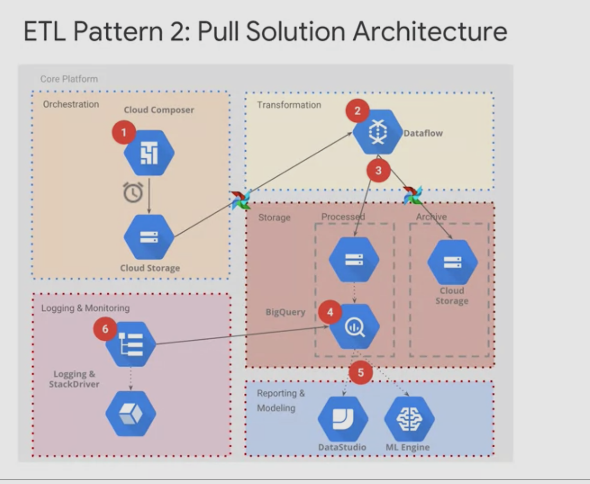

reason why it is only 5% of the code base is in this next image 

TFRecord files are more fast than csv files.

If you have streaming data use PubSub, if using structured data from datawarehouse use bigQuery.

You should always validate the format of your data stream, if your model expects data from 0% to 100% and one system decides to give 0 to 1.0 you should detect that because it will throw off your model. You can check the data distribution. You should implement validation checks that answer any relevent questions about the data like the ones in teh image 

IF your model has to be constant (like laws of physics, set in stone) static models are good. If your model has to be like fashion (changes constantly) then dynamic models are better. 

there are 3 possible ways to do dynamic models on gcp

These are inside google cloud composer which is a managed version of ApacheAirflow

you can't unlearn what the model has learned from poluted data. but you can roll back to previous backup of the model. That's why you should backup constantly.

Make sure your model doesn't memorize wrong things like people names, if you feed it a feature that includes ppl names and "actions" it might memorize that ppl with certain names tend to do certain actions. For example if you want to predict if a women is pregnant and in the training data it just so happens that a lot of pregnant women were named Fatima then the model will learn that which is wrong and it will not generlize well. Also make sure the model data is logical like if the women's age is 0 then she is no way preganant and that data should not be put in the training, it is probably a mis-inputted data or something and you should always put data validation checks to make sure that there're logical boundries since computers are dumb.

Kubeflow is an opensource software whos goal it to ultimatly push you to GCP loool