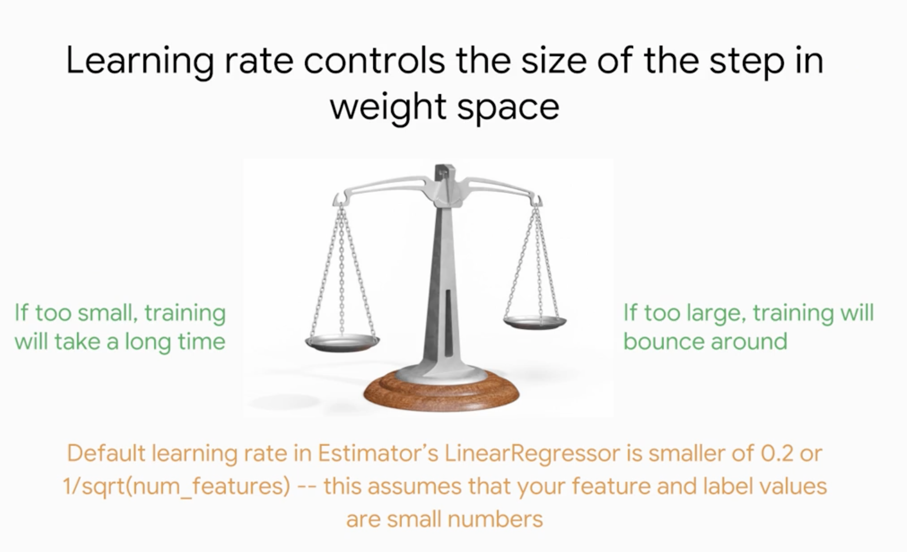
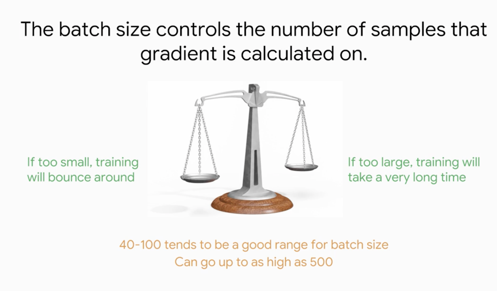
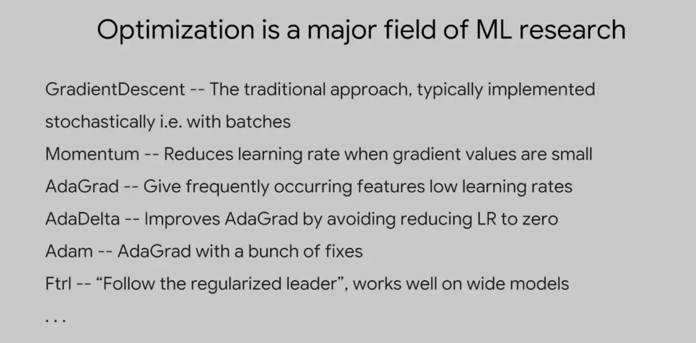
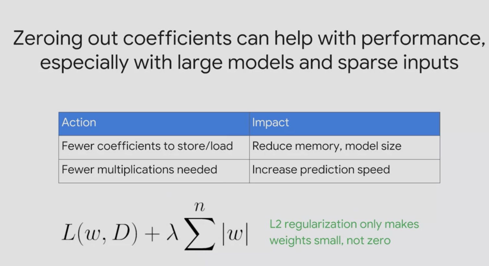
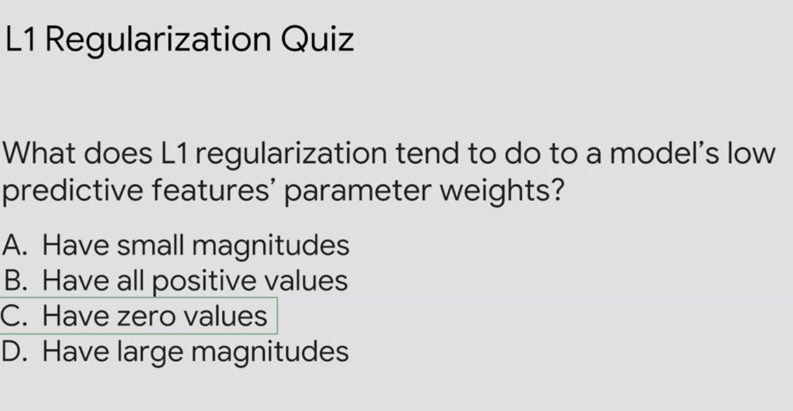
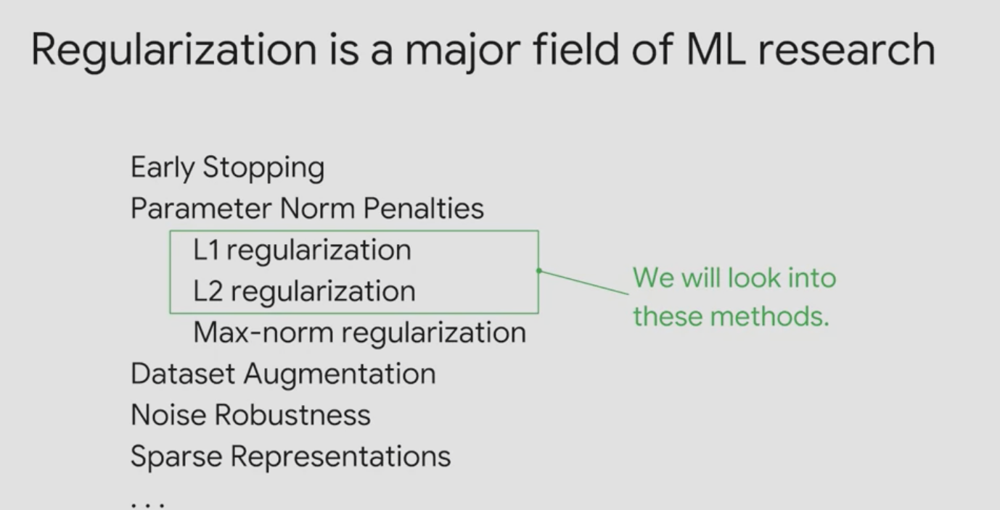
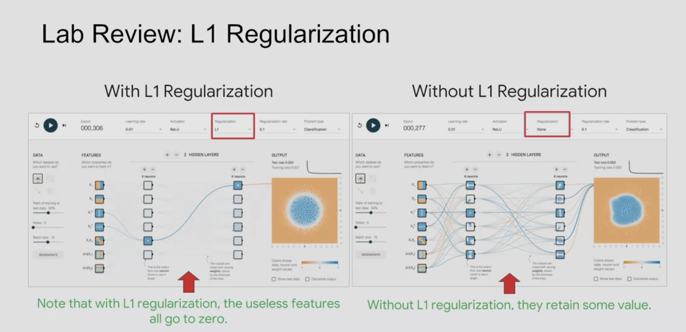
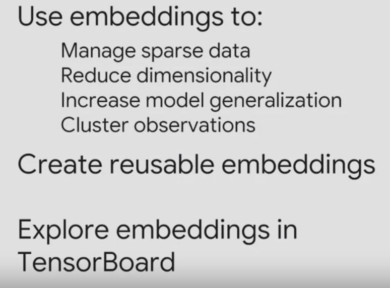
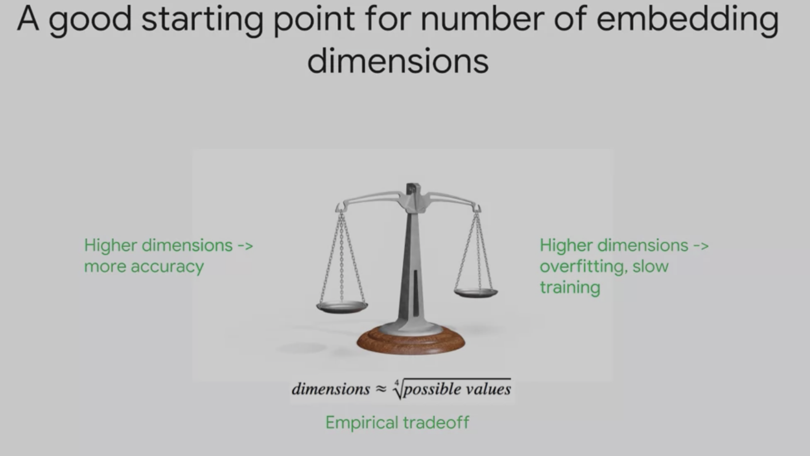

# Art and Science of machine learning

- Batch size is the number of samples the gradient is caluclated on
- 

- 

- we always randomize data cuz we dont want the model to memorize or learn the order
- 
- u need to know how many steps per epoch you need to traverse your dataset once, note that this will change depending on batch_size
- Google Vizier does auto hyperparameter tunning for us

- 
- 
- 
- Regularization can help make our model more "lean" and reduce train time
- regularization is a way to deal with lose, should we punish huge weights? or should we amplify others? things like that affect how we update our weights in the next epoch
- 
- L1 shrinks the less important feature’s coefficient to zero thus, removing some feature altogether. So, this works well for feature selection in case we have a huge number of features
- L1 increase sparcity to our model
- 
- 
- the more the inputs tehe bigger the model and the more time it takes to train, embeddings allow us to reduce teh number of inputs, emeding is  a way of endoding the input before inputting it to the model
- One-hot encoding is a type of embeddings
- i can use embeddings for my quraan classifier
- 