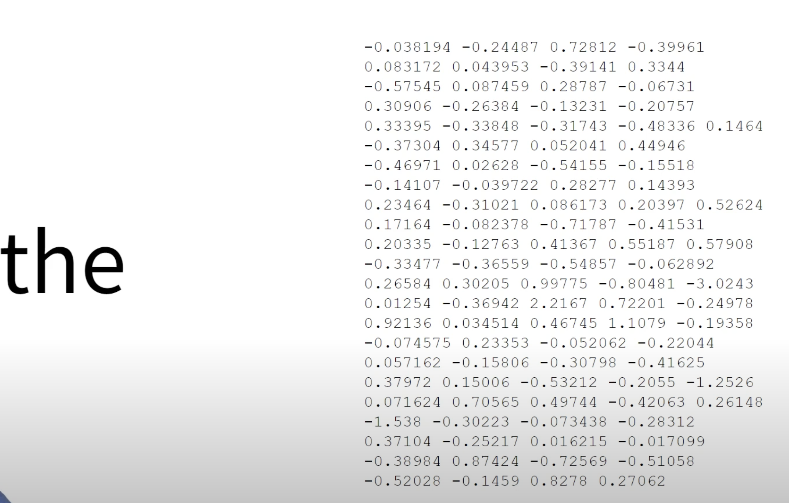
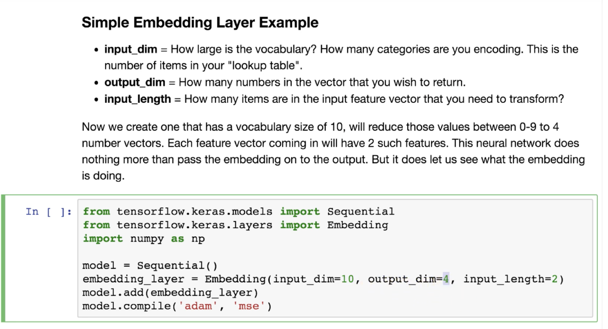
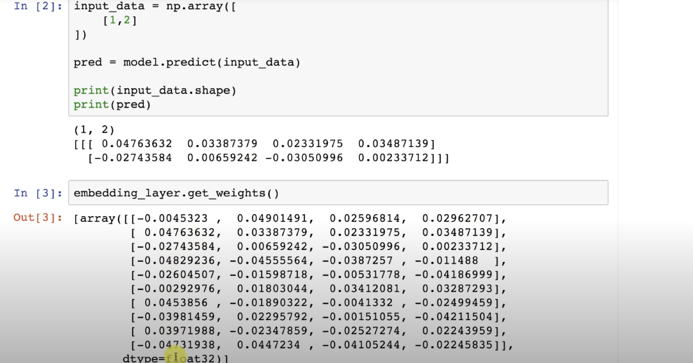

# Natural Language Proccessing

Text analysis, Speech recognition, translation all fall under NLP

Computers can't understand words, they need to convert words to numbers. To do that, we *tokenize* the text to get a number for each word.
Note that order matters of words matter almost always, so we need a way to retain the sequence of words.

Note that tokeninzing letters is really bad at handling anagrams, anagrams are words that have the same letters but in diffrent orders and mean different things
for example "infests" has the embedding as "fitness" and they both mean different things. That is why use ```tokenizer.texts_to_sequences(sentences)```

OOV = out of vocabulary word, when the tokenizer sees a word that is not in its vocab set, it will assign the OOV value to it.

## What are word embeddings?

Word embedding or word vector is a vector representation of a word.
*The word 'the' is represented with this length 500 vector https://youtu.be/oUpuABKoElw?t=26*

## Embedding layer

For each index the embedding layer will generate a random vector, e.g. [[4], [20]] -> [[0.25, 0.1], [0.6, -0.2]]
https://www.youtube.com/watch?v=qpb_39IjZA0
An embedding layer is like one-hot-encoding or using latent variables https://youtu.be/OuNH5kT-aD0?t=52
it takes x input dim, and reduces it to y output dim almost as if its "encoding" the input, input length is the sequece length 
*https://youtu.be/OuNH5kT-aD0?t=178*

Think of embedding layer as a lookup table, each of the 10 input dims and each of them will output a different unique set of 4 numbers from the output dim
ie 10 rows and 4 columns
*https://youtu.be/OuNH5kT-aD0?t=324*


 there’s an unofficial Google repository called SentencePiece that contains some interesting techniques for improved creation of the subwords dataset from an original text dataset.

#### Useful NLP datasets

- https://github.com/niderhoff/nlp-datasets
- https://datasetsearch.research.google.com/
- https://www.kaggle.com/datasets