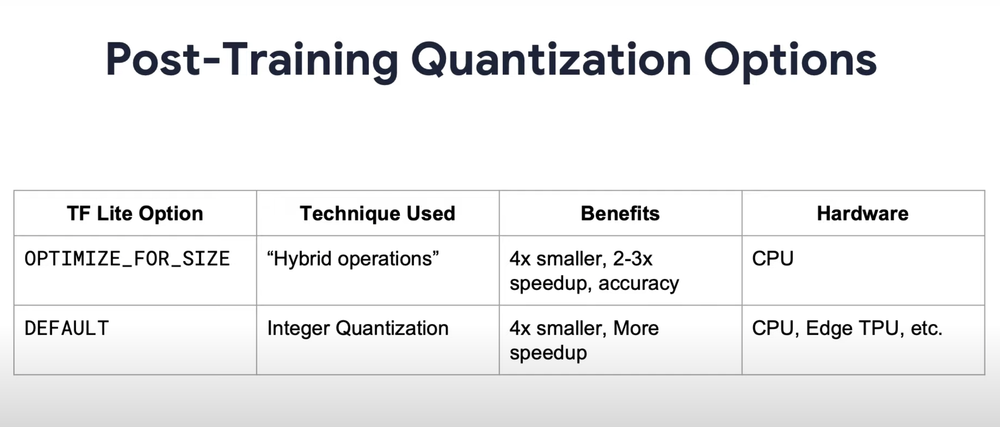

# Tensorflow lite notes

Quantization helps us convert reduce the cost of using inference (using ML) by reducing hardware requirement
For example, a model has its weights in 32-bit floating number, we can represent the weights in the model with 8-bit number instead (quantize it)
the 8-bit number is smaller and has lesser memory requirement therefor easier to run on a mobile phone.

You can quantize during training or post training
TFlite offers 2 types of post training quanization seen in the image 

 1. `OPTIMMIZE_FOR_SIZE` quantizes only the weights
 2.  `DEFAULT` quantizes the activation outputs and weights

*https://youtu.be/J3NiJkgkVd8?t=85*

## Cool resources
https://www.tensorflow.org/lite/models/