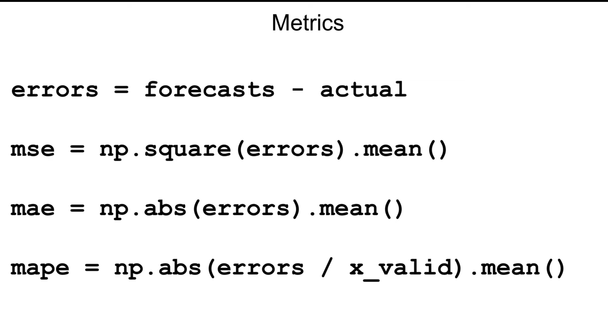
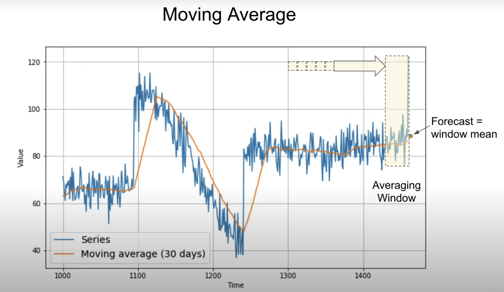

# Time series forcasting with ML

P.S. Arima model usually does a better job than pure machine learning. For time series forcasting checkout this course https://www.udacity.com/course/time-series-forecasting--ud980

Anything that changes with time and (hopfully) can be represented with a graph (model) of the data
 Stock prices, weather patterns, audio clips are all examples of time series.

 Time series forcasting helps us (predict) the future.

     Once you have a model (graph) of your data and a period, we need a way or a *metric* to evaluate the model.
       *Most common metrics https://youtu.be/vEozDGPwQ7c?t=33*
        mse = mean square error
        rmse = root mean square error (has the advantage of being close in scale to the actual value in the time series so it is easier to interpret )
        mae aka mad = mean absolute error or mean absolute deviation
        mape = mean absolute percent error --> idea of size errors comared to values in the model
 mae does not penalize large errors as much as mse, so depending the task one might choose mae or mse, example, if large erros are dangrous then choose mse. OR if the loss is proprtional to the size of the error then mae is better.

 Say we have this model that has sensonality, noise, and trend and we want to perform forcasting on it, that's hard if the model is as is, so we try to isolate and clean the model. If we use a moving average we remove noise,but fail to forcast trend or seasonality

 *remove noise by a moving average(the sum of the mean until time t . https://youtu.be/vEozDGPwQ7c?t=113)*

 ## Read the jupyter notebooks in this order:
 1. l08c01_common_patterns.ipynb
 2. Predicting_the_future_without_ML.ipynb
 3. Dataset creation and Time window.ipynb
 4. Forcasting with ML and ML tricks!.ipynb 
 5. Forcasting_CNN_Best_Result.ipynb
