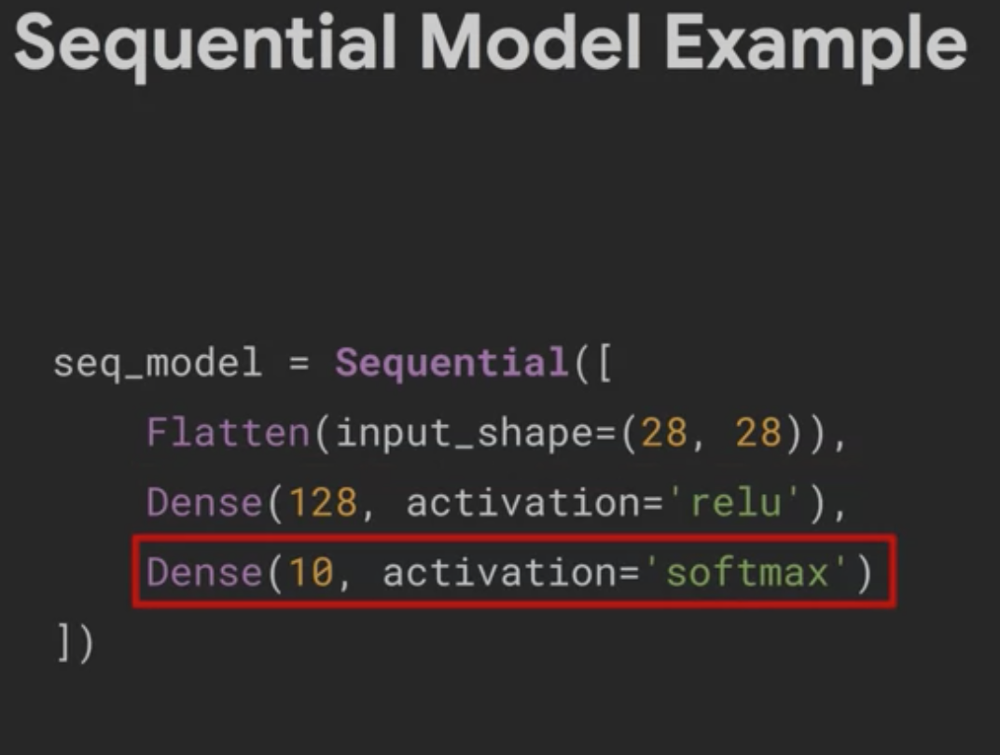
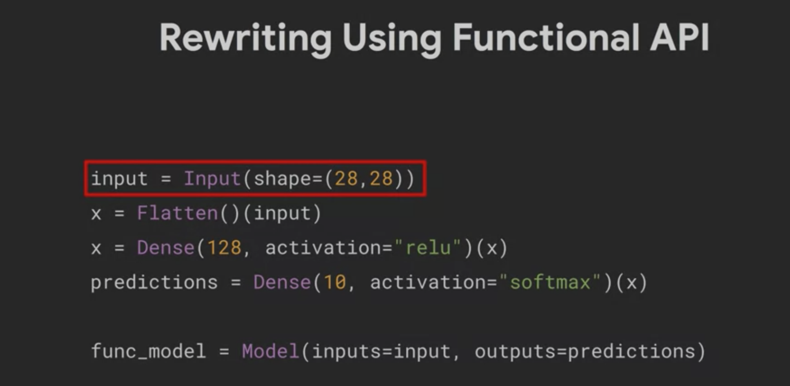

### Sequential model example

1. The model is return by the Sequential functin
2. The first layer is flattten to make the shape of the input into a single array so it can fit the the dense layer
3. the dense layer has 128 neurons, each has the relu activation functino
4. those 128 from previous layer are fed into 10 neurons of the next layer that has 10 neurons, each neuron is for an object that we classify. The softmax function means that we output a probability

### Rewriting with the functional API
