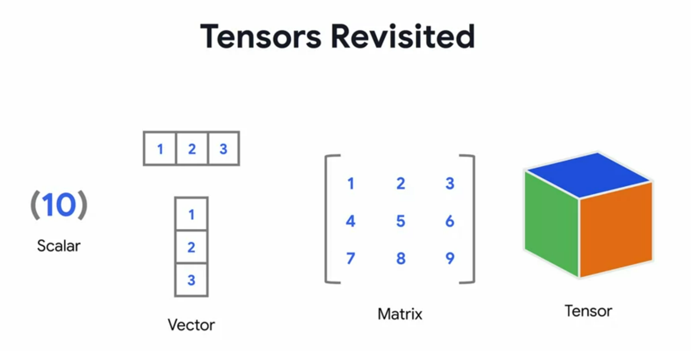
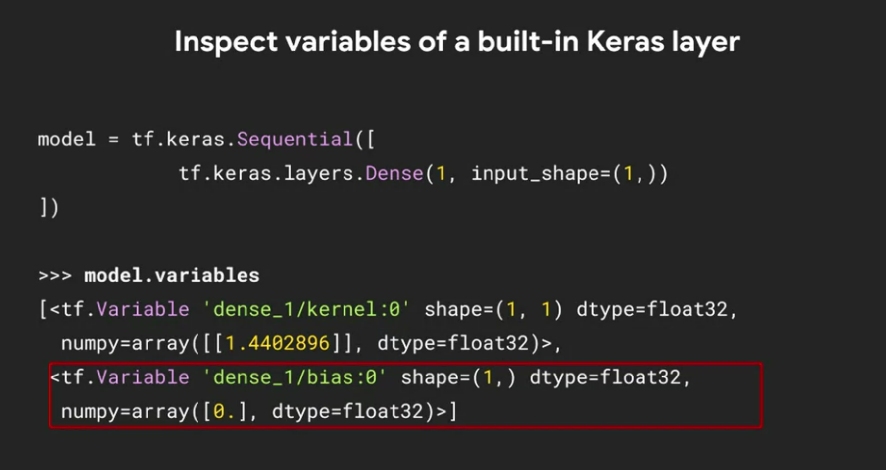
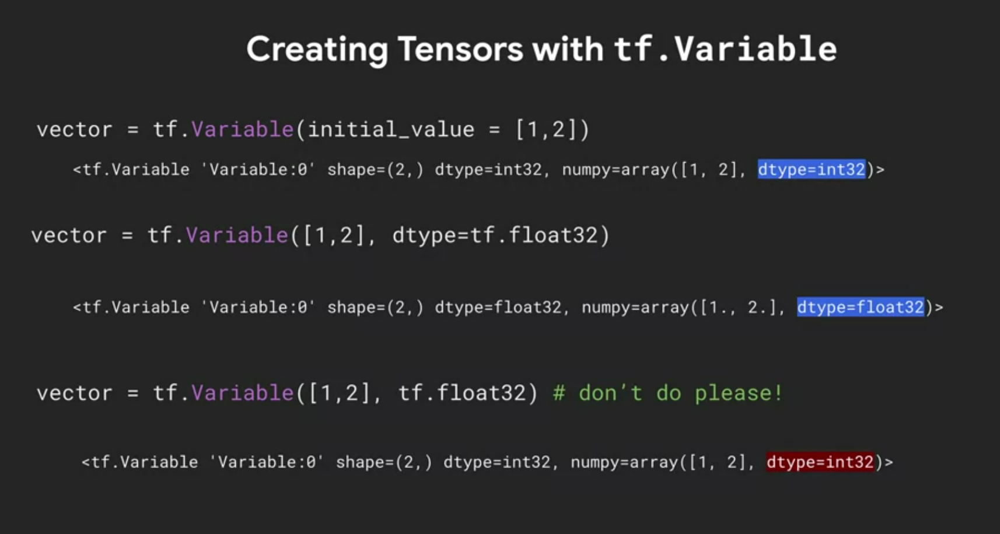
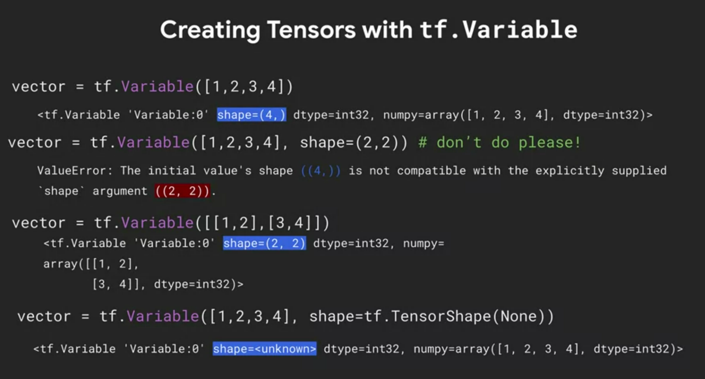
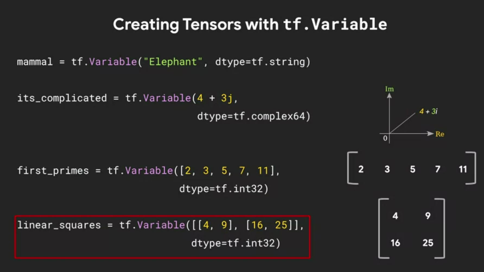
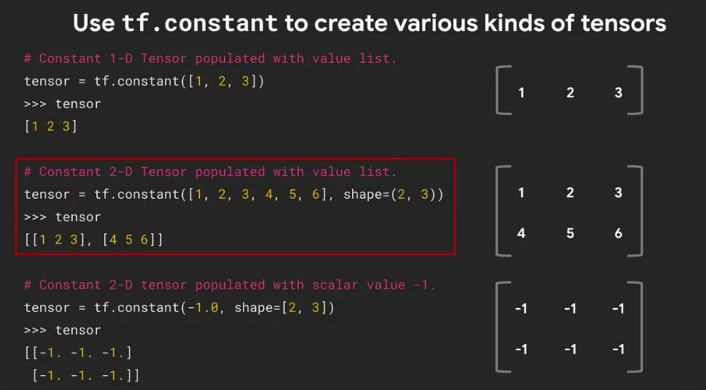
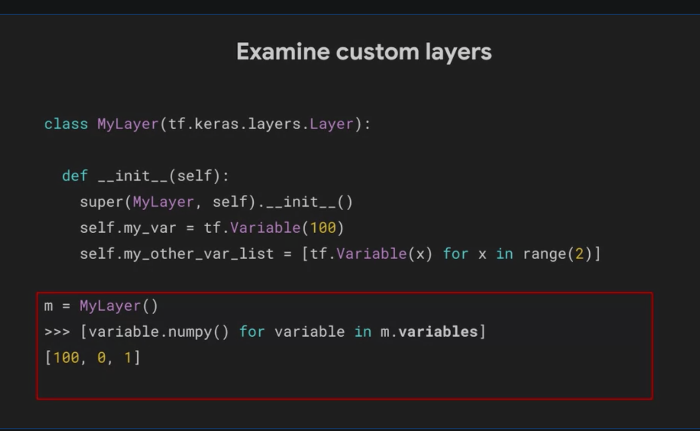

Custom and Distributed Training with TensorFlow

https://www.coursera.org/learn/custom-distributed-training-with-tensorflow/lecture/poLBG/a-conversation-with-andrew-ng-overview-of-course-2

#  Week 1
##  What is a tensor

- types of tensors
  - `tf.Variable` can change (mutable),ex, `tf.Variable('Hello', tf.string)`
  - `tf.constant` cannot change, it is immutable, ex `tf.constant([1,2,3,4,5])`
  - `tf.constant([4,6])` --> `tf.Tensor([4 6], shape=(2,) , dtype=int32)` int32 is a 32 bit integer.
- 
- 
- 
- 
- You can't reshape a tf.Variable using the `shape` keyword argument. However, you can reshape a tf.constant using it!
- 

## Broadcasting, overloading and Numpy compatibility

- There are two way to execute code in tensorflow
  1. Graph based, when we put all code in a seesion in one graph and execute it in one go after we wrote all the code
  2. Eager based, when we execute the code line by line
- Broadcasting is performing ops on different shape tensors 
- tensors and numpy are compatable, and np-arrays and tf-tensors are interchangble
- you can convert a tensor to np-array using `tensor.numpy()`
- When you inherit from the class Layer you have a property that lets you access all tensor class variables, regardless what they are called inside the class 