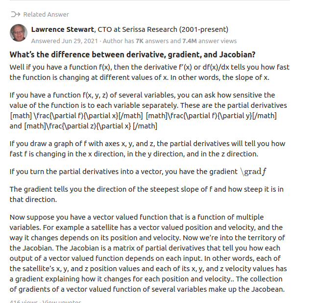
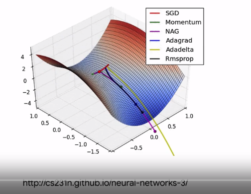
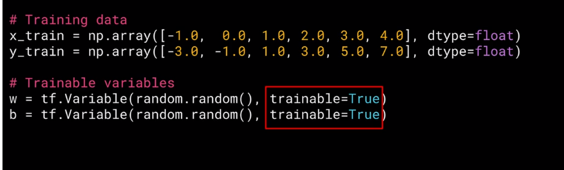
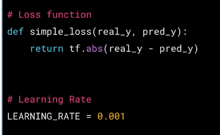
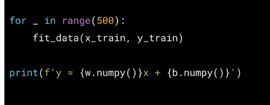
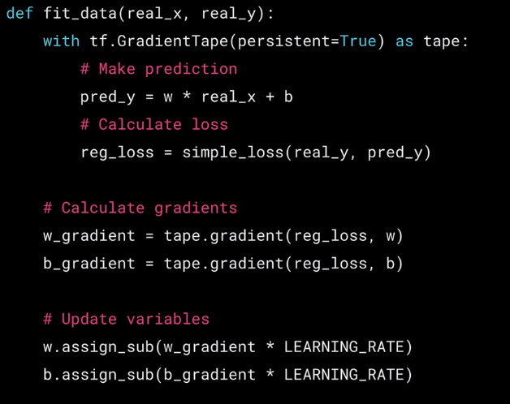

Custom and Distributed Training with TensorFlow

https://www.coursera.org/learn/custom-distributed-training-with-tensorflow/lecture/poLBG/a-conversation-with-andrew-ng-overview-of-course-2

#  Week 1
##  What is a tensor

- types of tensors
  - `tf.Variable` can change (mutable),ex, `tf.Variable('Hello', tf.string)`
  - `tf.constant` cannot change, it is immutable, ex `tf.constant([1,2,3,4,5])`
  - `tf.constant([4,6])` --> `tf.Tensor([4 6], shape=(2,) , dtype=int32)` int32 is a 32 bit integer.
- 
- 
- 
- 
- You can't reshape a tf.Variable using the `shape` keyword argument. However, you can reshape a tf.constant using it!
- 

## Broadcasting, overloading and Numpy compatibility

- There are two way to execute code in tensorflow
  1. Graph based, when we put all code in a session in one graph and execute it in one go after we wrote all the code
  2. Eager based, when we execute the code line by line
- Broadcasting is performing ops on different shape tensors 
- tensors and numpy are compatible, and np-arrays and tf-tensors are interchangeable
- you can convert a tensor to np-array using `tensor.numpy()`
- When you inherit from the class Layer you have a property that lets you access all tensor class variables, regardless what they are called inside the class 

## Gradient Tape

### Few words about differentiation and gradient

Derivative is the rate of change at a certain point, in other words it is the slope at a point or how steep the slope is at point (x,y).

Gradient is a vector, it points in the direction of the steepest slope. If you have a function of f(x,y,z) or even more than 3 variables, and you take the partial derivative of the function with respect to each variable you will have a vector telling you in which direction (x,y,z) the slope is steepest, and this is called the gradient.

The gradient can be either positive or negative depending on the sign of the gradient. Positive gradient tells you the steepest slope upwards and negative gradient tells you the steepest slope downwards.

Differentiation is the derivative operation, computers can do it numerically by using difference equations, or they can do it symbolically.

 
[Link](https://www.quora.com/What-is-the-difference-between-a-gradient-and-a-derivative)

### Back to gradient tape in tensorflow

The core of machine learning is optimizer functions that try to match features to labels by tweaking parameters. These optimizer functions work on _Gradient Decent_ and each optimizer function has its rate of convergence towards the optimal value (which is usually minimum loss).

In Tensorflow optimizer functions or algorithms are implemented using Tf automatic differentiation API called _Gradient Tape_ . This API lets you compute and track the gradient of every differentiable tensorflow operation
.

The gradient tape knows which variable we can use to differentiate when we use the `trainable=True` keyword argument.

This function is `y=2x-1` and see if the model can learn if x=2 and b=-1.

This is the training for loop

This is where the learning happens, in the fit_data function

Note that we can use the tape variable outside the tape block in the image above

We want the derivative of the loss with respect to the weight w, so we do this as seen in the image above.
`w_gradient = tape.gradient(reg_loss, w)`
The negative of this gradient will point in the direction of optimal value for w, forming a very basic optimizer.

The assign sub that updates the parameter w and b, 
The math for back propagation is `w = w - gradient(loss,w)*learning rate` 
the assign_sub does that equation exactly