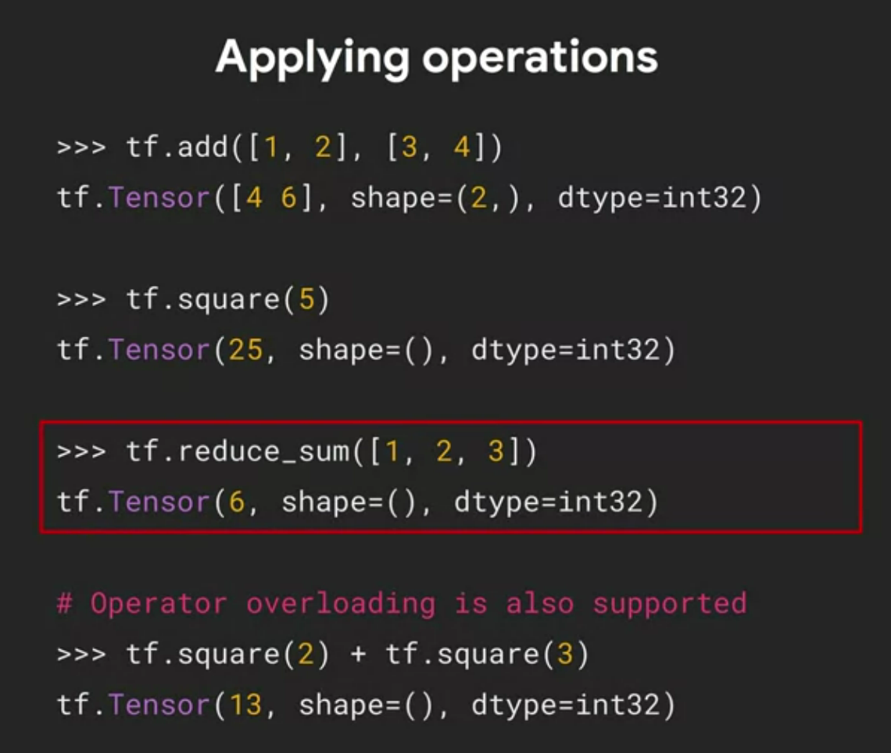

Custom and Distributed Training with TensorFlow

https://www.coursera.org/learn/custom-distributed-training-with-tensorflow/lecture/poLBG/a-conversation-with-andrew-ng-overview-of-course-2

#  Week 1:  What is a tensor

- types of tensors
  - `tf.Variable` can change (mutable),ex, `tf.Variable('Hello', tf.string)`
  - `tf.constant` cannot change, it is immutable, ex `tf.constant([1,2,3,4,5])`
  - `tf.constant([4,6])` --> `tf.Tensor([4 6], shape=(2,) , dtype=int32)` int32 is a 32 bit integer.
- 
- 
- 
- 
- You can't reshape a tf.Variable using the `shape` keyword argument. However, you can reshape a tf.constant using it!
- 
- 
- 