# generative-deep-learning
look at my pytorch file it has better/similar explanation of style transfer

## Style transfer

Approaches to style transfer:
1. Supervised learning: this is when you feed the network images and desired stylized images, and the network learns to produce the stylized image. Needs a lot of pairs of images for inputs and labels -> (original, stylized images) . Needs a lot of training data.
2. Neural Style transfer: Don't need to train the network to produce styles, instead, we extract features using a network and apply those as styles. Similar to transfer learning. 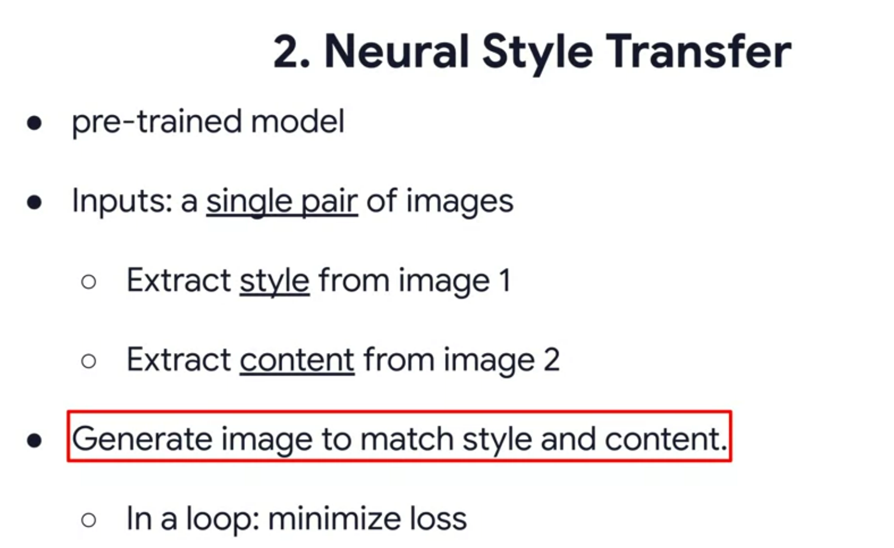
3. Fast Neural Style transfer, it's a lot faster than neural style transfer

In CNNs the first few layers extract low level features, such as lines and simple shapes. 
The deeper levels extract higher level features such as faces, wheels, paws ...etc
So the style transfer usually maintains the higher level features but changes the lower level features to match the style source image. 

For example imagine you're drawing a bird, you can either choose a pencil or a paintbrush. The style of the drawing will depend on the drawing instrument you chose, however in both drawings you will have the bird's high lvl features such as beak, eyes, feathers, wings ...etc but what's different is the lower level features or the "stroke of the paint" features. 

## loss
We have two losses the style loss and the content loss. if the content loss is 0 then we have the original image. So we try to increase the content loss (counterintuitively) but not increase it too much that we don't recognize the image, but enough that the style and image merge together nicely.

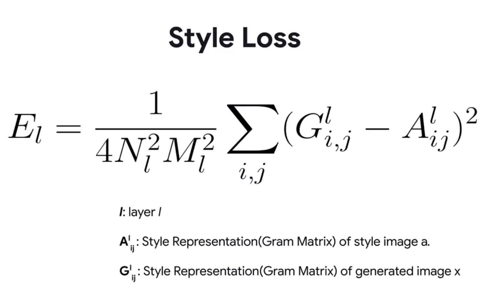
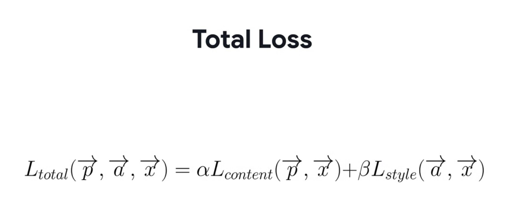 where alfa and beta are weights for each loss.

## Optional concepts
we don't need to understand it to solve the labs and assignments, but I want to learn it so here it is.
### The Gram Matrix

For more in depth gram matrix stuff go to `pytorch/lesson6-notes-styleTransfer.md`

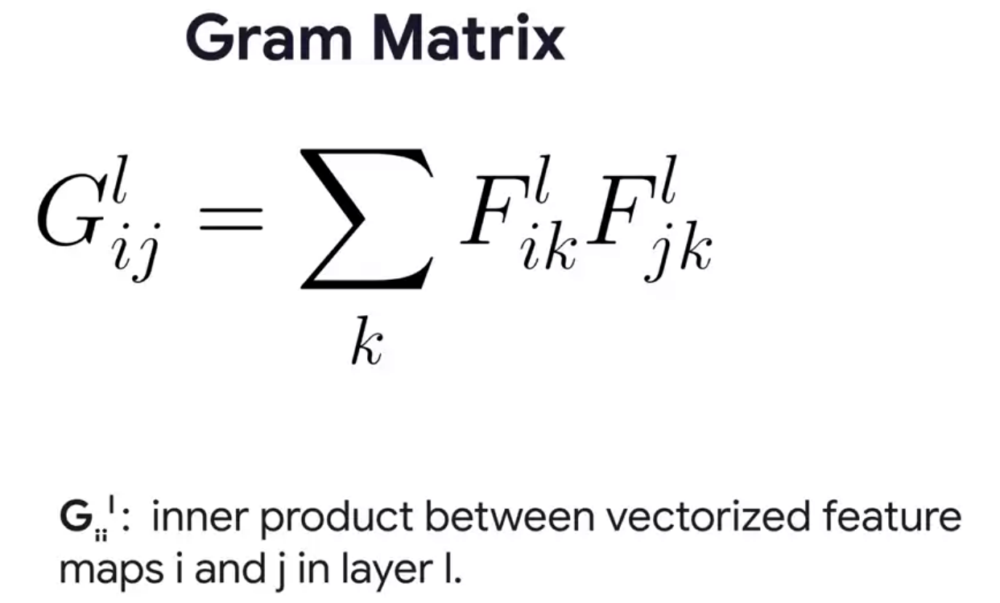
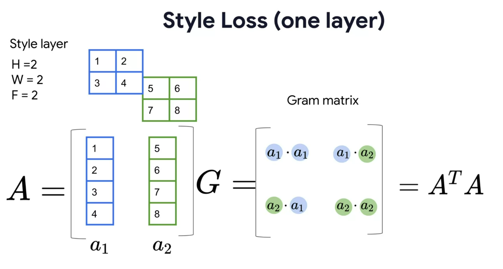 so the gram matrix is effectively a permutation of cols a1 and a2

In code it looks like this. Note that at the end we can get G using einsum notation which is a very 'short' way of typing everything that was typed above it 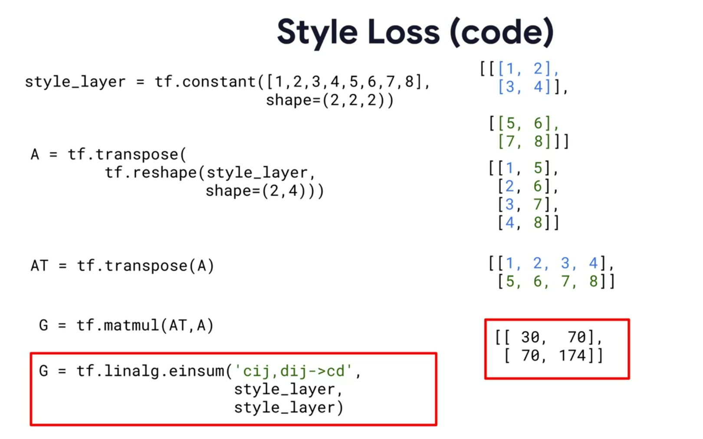

### Einstein notation (einsum)
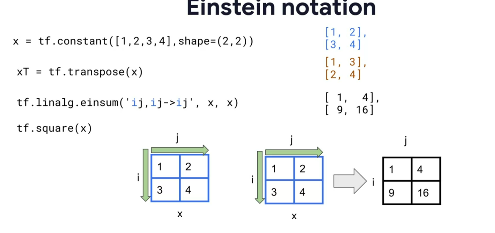 the `-> ij` mean that we want the output to have i rows and j columns.

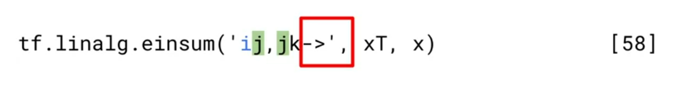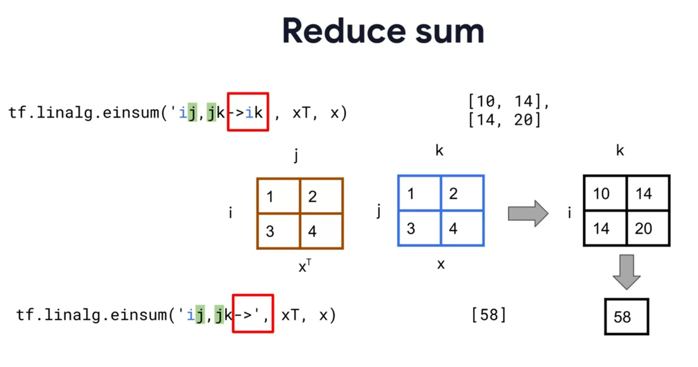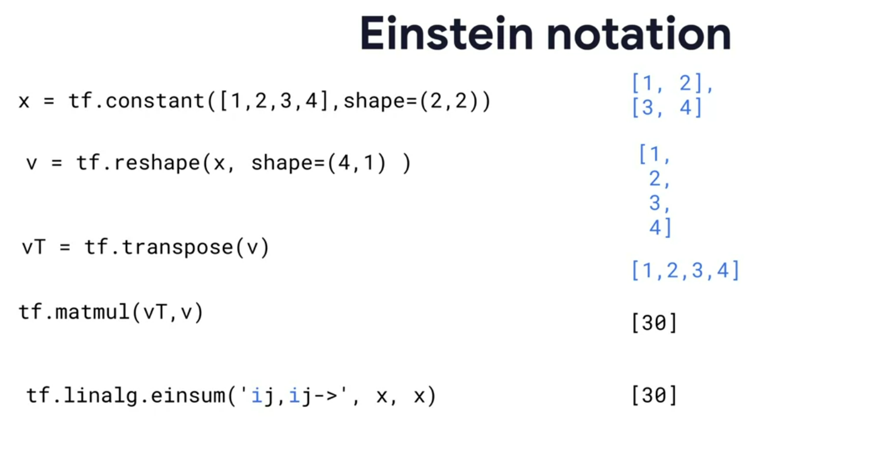

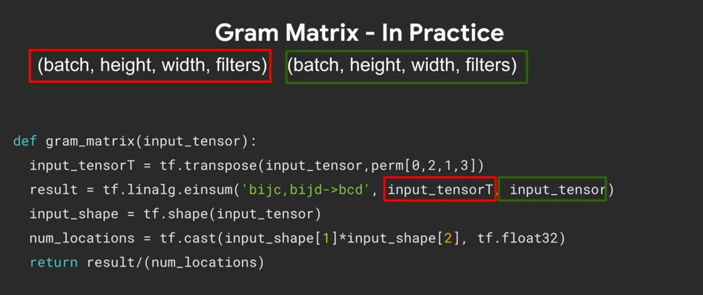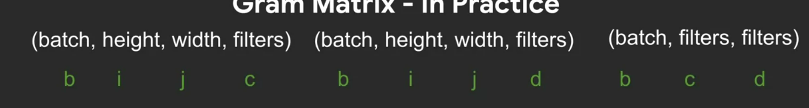

There are many ways to do style transfer, one of them is the supervised approach which we're going to use in lab 1. 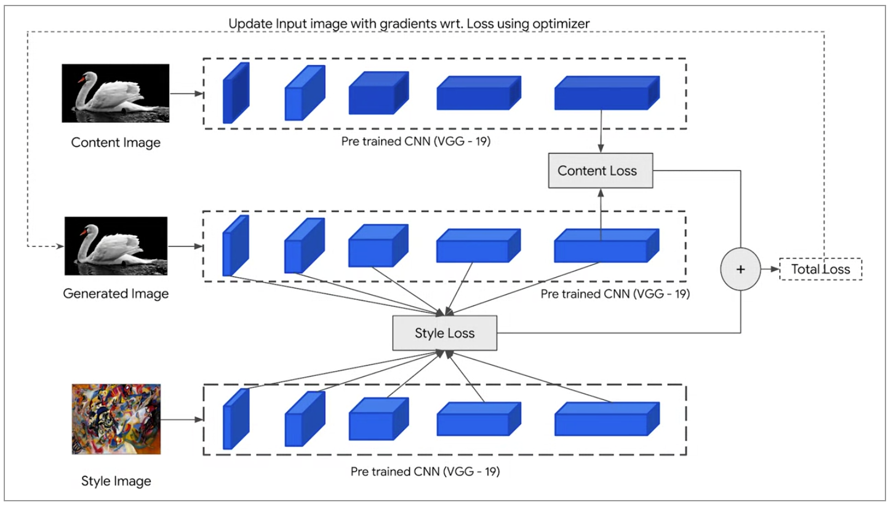

## Improving the style transfer

Now you may have noticed after lab1 that the stylized image has high frequency artifacts (ridges) that we'd like to remove. well, we can remove them with a high pass filter!
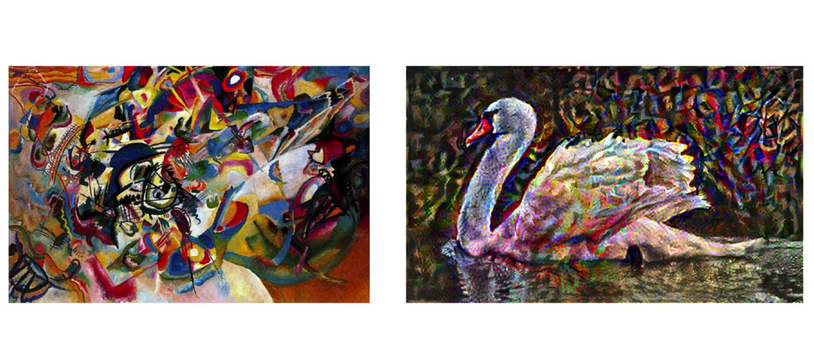 Observe the hard ridges in the stylized image.

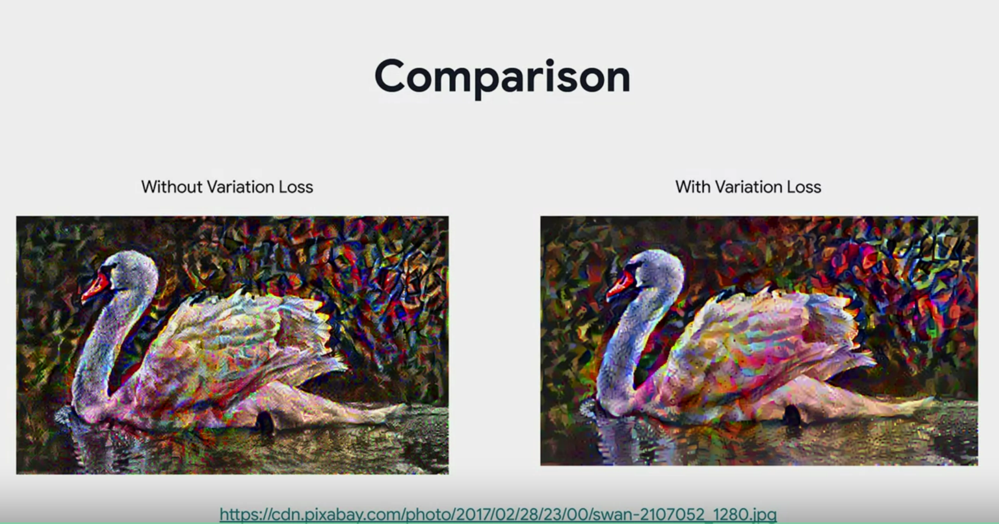

# Week 2 AutoEncoders
- They are neural networks capable of learning dense representations of input data  without supervision(training data is not labelled)
- They are good for dimensionality reduction and visualization
- can be used to as an efficient way to represent data.

For example take a look at these 2 sequences of numbers 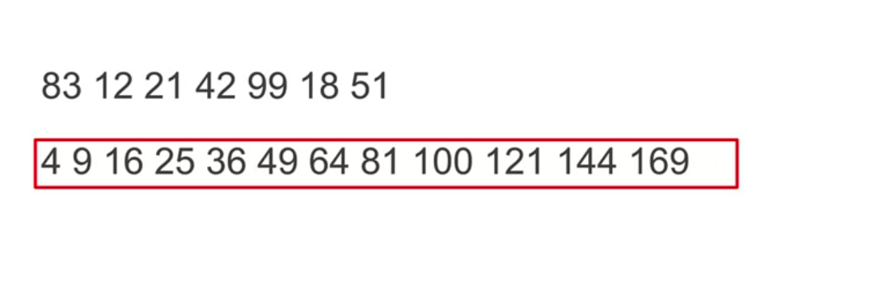

If you're asked to look at one of them and memorize it, which one is easier?

At first glance you might say the first one, but on a second though the second sequence is easier because there's a pattern, they're all squares, so you wouldn't have to remember them, you could just figure them out from the pattern.

The pattern is called _latent representation_ and the goal of auto-encoders is to create this latent representation or pattern.

  