# Advanced computer vision

https://www.coursera.org/learn/advanced-computer-vision-with-tensorflow/lecture/e4mbd/what-is-transfer-learning

## Week 1 Transfer learning
it is using a pretrained model's weights to donwstream the trainig of our current model. For example if I alredy have a model that can classifiy cats and dogs, I can "downstream" that model's weights to train a new model that classifies cows and horses. Training from scratch is very demanding, transfer learning can help reduce time and can even improve accuracy

### Options in transfer learning
The closer the layer is to the input the more "general" it is, and the closer to the output the more it is "specific" features. So in general it is better to transfer the first CNN feature extractor layers and not the final dense classifier head
1. Freeze weights of cnn and use them as they are, and only train the classifier dense 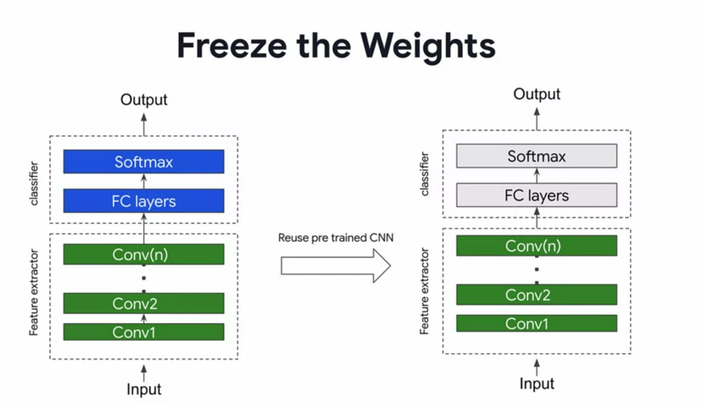
2. use the weights of the cnn as a starting point and train them even further along side the classifier which you're gonna train from scratch 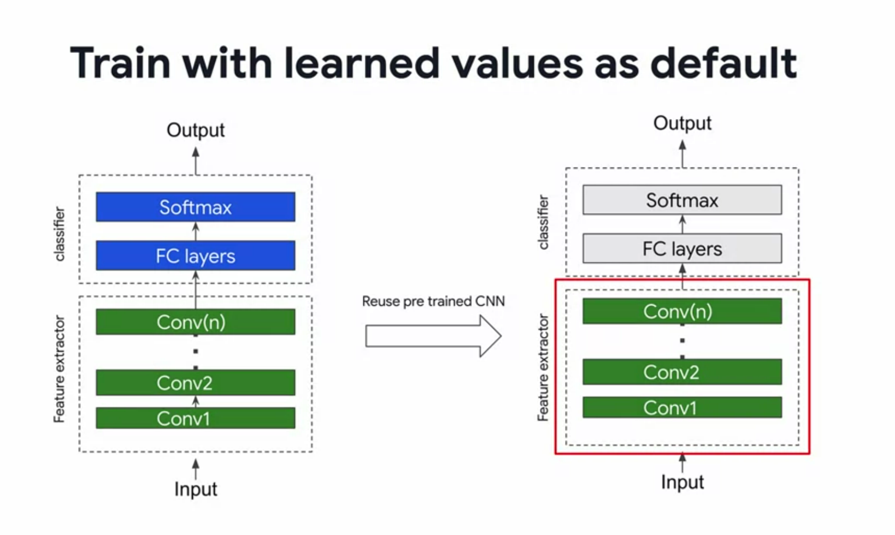

If we want to use transfer learning with ResNet  model and the CIFAR dataset

CIFAR images are 32x32 but the resnet model expects 224x224 so we need to use an upsampling layer
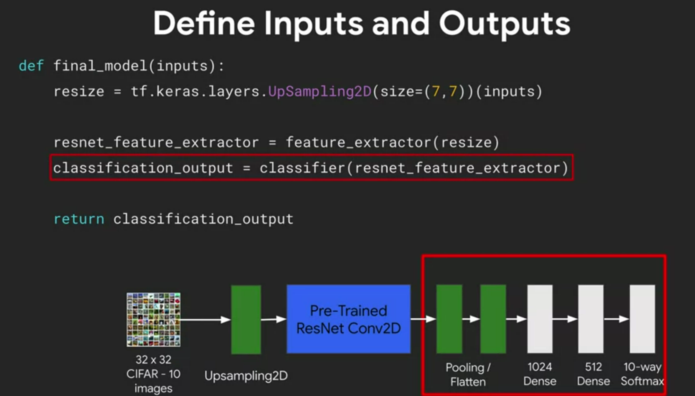

## Week 2 object detection and sliding windows

If you have an image that has multiple instances of the object you want to detect, and it also has empty space and other things that you don't want to detect you have to be smarter about how you do your object detection

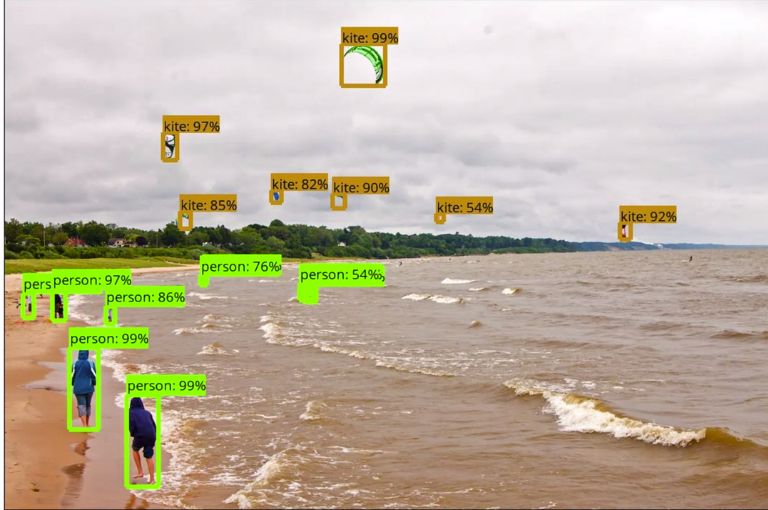

There are two stages to Object Detection:
1. Region proposal (what region of the image you will pass to your classifier, you can't pass all of it if it is a big image because that would be too inefficient)
2. Object detection/classification
   

There are few ways to detect an object within an image:
   1. Scanning the image with a sliding window that scans the image as the window slides, similar to convolution in how it scans. We try to classify what's in the window and ignore everything else :
      -  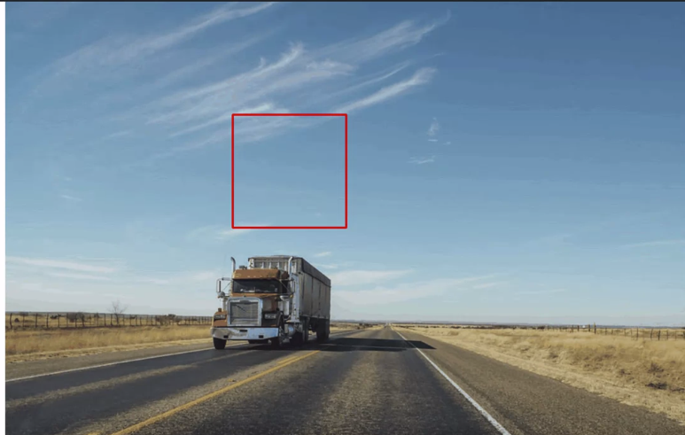 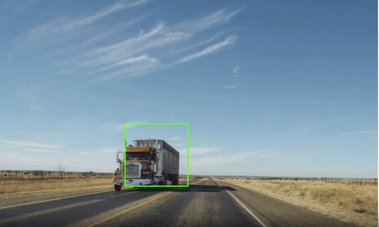 
      - We can play with the size of the window
  
  2. Similar to sliding window but here we change the size of the image to work with less pixels, and then we can expand the image. Or we can calculate a union with different sized images detected objects to maximize accuracy
     - 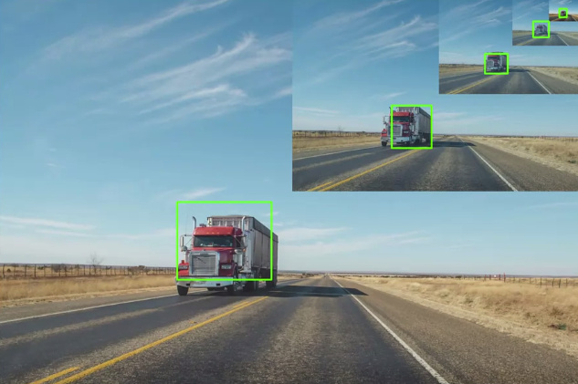
  3. Selective search, this method takes longer but it has good results. The algorithm makes proposals where the object is and then it combines the squares that contain the image
     - 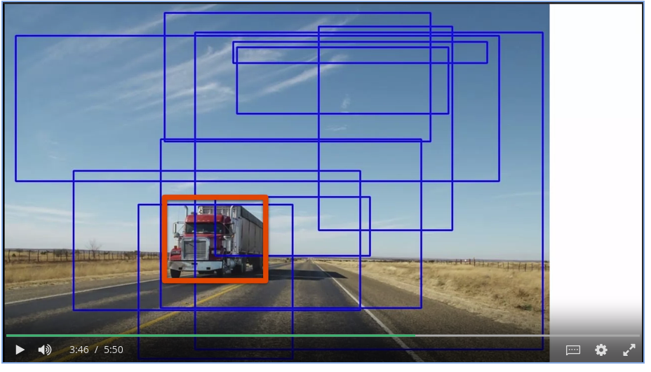

**R-CNN**
aka Regional CNN implements selective search on an image
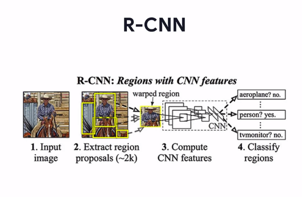

**RetinaNet**

Can predict bounding box around the image as well as classify the image. This model has its Model architecture separate from it's trained weights, this is often done in research. So we will have to load the model arch from a configuration file then load the weights from a checkpoint and combine it with the model if we want to use the model for transfer learning.

We want to retrain that pretrained model and load some of the pretrained weights saved in a checkpoint. All in order to predict and classify a novel class that wasn't part of the original training data of the model.

Since the model has 2 heads: 1. a bounding box predictor and a 2. classifier we will follow these steps to reuse the model:
1. take the base layers and the box prediction head as is
2. take the classification head and separate it from it's feature extractor, we will use the feature extractor only and discard the classification head 
3. then pass the model to checkpoint, then we will be able to restore pre-trained weights 
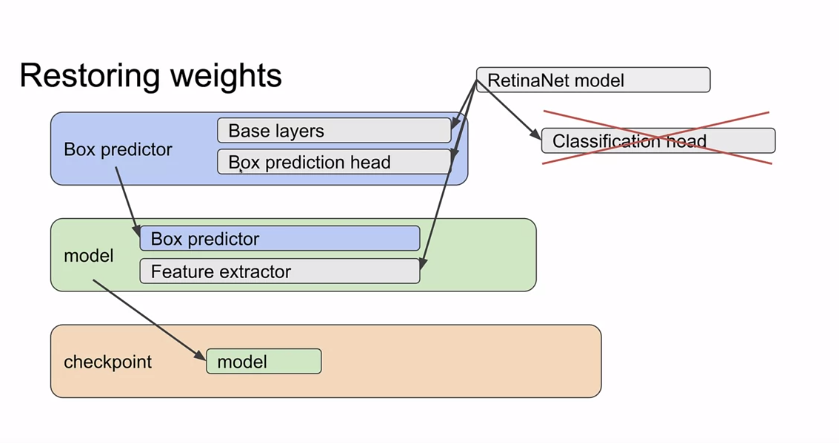

We need to decide which trainable variables we're going to train, to see all trainable variables we can do code like this, note that RetinaNet is a huge model so we'll have a lot of trainable params, this is just a sample:
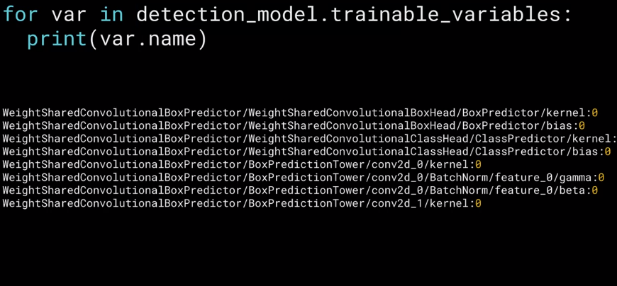

To choose which ones to fine tone we do something like this. Remember that since the weights are already loaded form a checkpoint we don't have to train from scratch we will use the existing weight values as a starting point when we fine tone the trainable parameters we want.
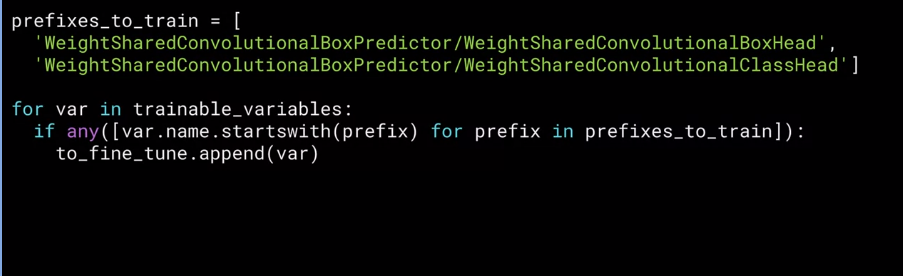

