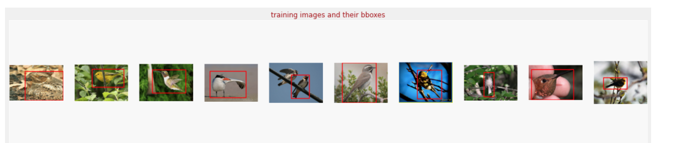
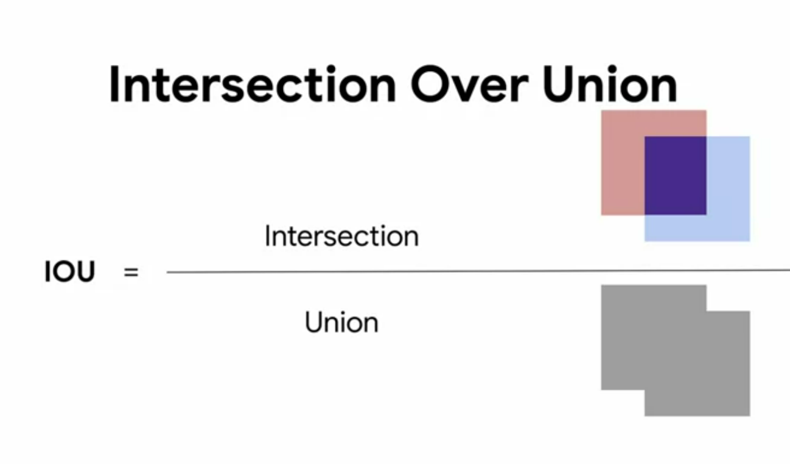
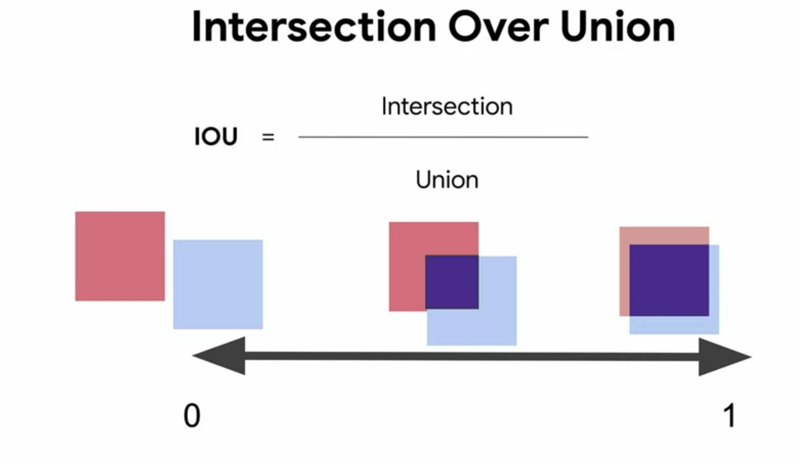

# Advanced computer vision

https://www.coursera.org/learn/advanced-computer-vision-with-tensorflow/lecture/e4mbd/what-is-transfer-learning

## Week 1 Transfer learning
it is using a pretrained model's weights to donwstream the trainig of our current model. For example if I alredy have a model that can classifiy cats and dogs, I can "downstream" that model's weights to train a new model that classifies cows and horses. Training from scratch is very demanding, transfer learning can help reduce time and can even improve accuracy

### Options in transfer learning
The closer the layer is to the input the more "general" it is, and the closer to the output the more it is "specific" features. So in general it is better to transfer the first CNN feature extractor layers and not the final dense classifier head
1. Freeze weights of cnn and use them as they are, and only train the classifier dense 
2. use the weights of the cnn as a starting point and train them even further along side the classifier which you're gonna train from scratch 

If we want to use transfer learning with ResNet  model and the CIFAR dataset

CIFAR images are 32x32 but the resnet model expects 224x224 so we need to use an upsampling layer

### Evaluating object localization
if you want to detect where an object of intrest is in the image (localize it in the image) you need to define a loss value that defines how well you can predict where the object is in the image, ie you're trying to predict the bounding box around an object of interest, here's what the triaing data would look like 

The loss we use is IOU or intersection over union, which is a value from 0 to 1 telling us what's the percentage of intersection, if we predicted the bounding box (bbox) correctly we'll have a big intersection, if we did it wrong we will have no or little intersection

