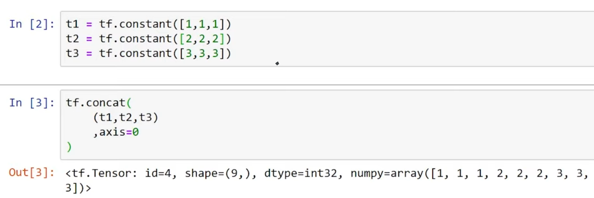
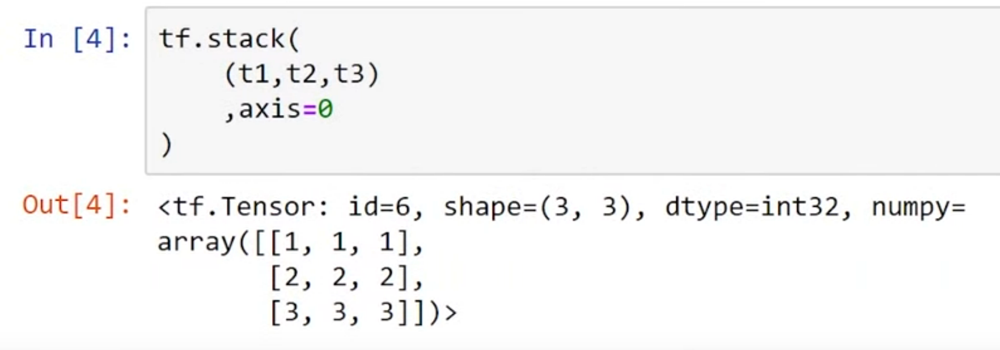
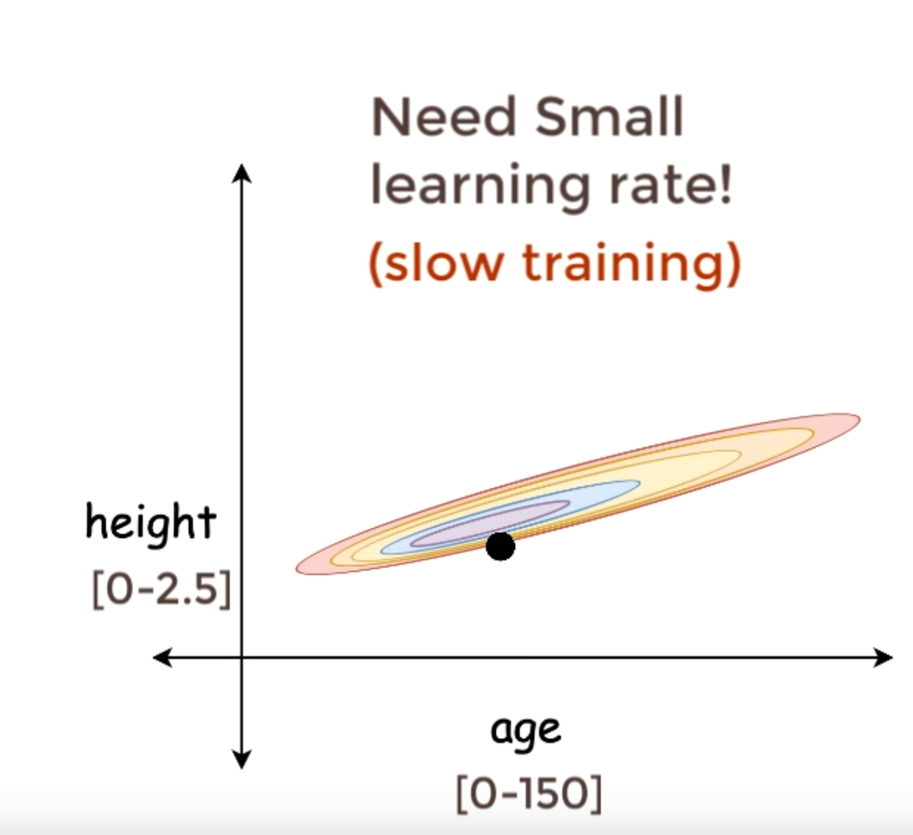
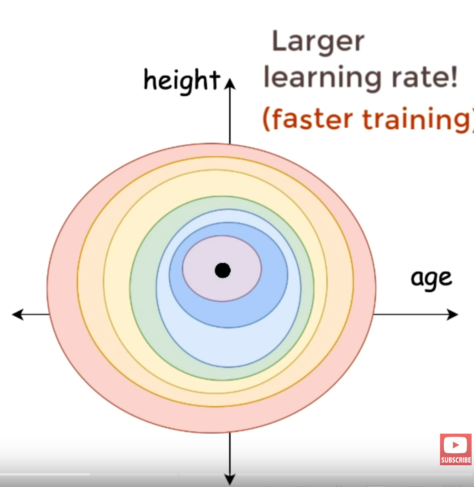
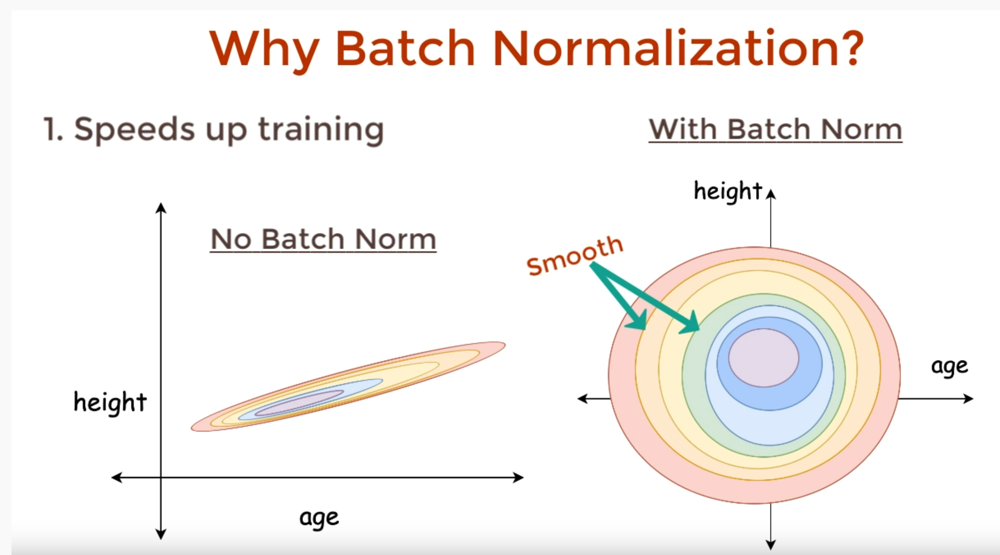
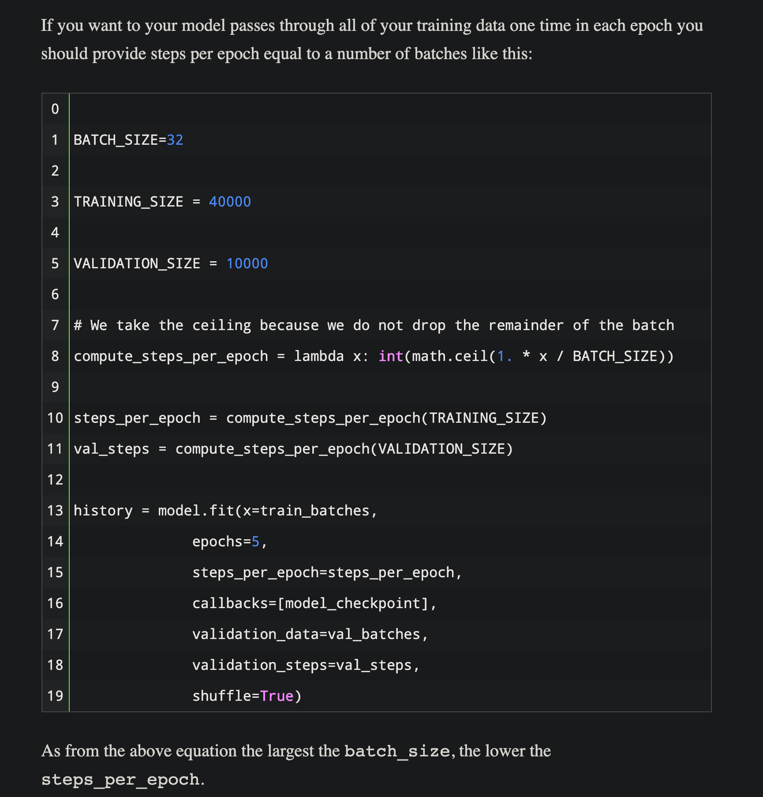

<style>
  img{
    max-width:60%;
  }
</style>

# General Machine learning notes

Gradient is another word for slope, the higher the gradient the steeper the line at a point ie the higher the slope, negative gradietn means that the slope is negative.
Oh and the derivative is the slope, like the derivatie is a way of obtaining the slope.

## Glossary
- NN = neural network

### Random Basic stuff

 *https://colab.research.google.com/github/tensorflow/examples/blob/master/courses/udacity_intro_to_tensorflow_for_deep_learning/l02c01_celsius_to_fahrenheit.ipynb#scrollTo=m8YQN1H41L-Y*

 <br>

*backpropgation https://classroom.udacity.com/courses/ud187/lessons/e0c70c77-5584-4f83-a47b-a67a6172ae75/concepts/ac6c6991-8096-4c7a-bad1-706f7e3d36f1*


Normalization is when u make ur data between 0 and 1, for example for a pixel vvalue form 0 to 255, so you want to move that range and map it to the range between 0 and 1. This gives us better results almost always

Regression is when u predict a single number/output from input data, for example estimating the price of a house based on its specifications is Regression
Classification, is when u classifu duh. Outputs a probability distribution

------------------------------------
____________________________________


### Gradient descent

The following screenshot is taken from MIT intro to deep learning course https://github.com/aamini/introtodeeplearning/blob/master/lab1/solutions/Part1_TensorFlow_Solution.ipynb


<br>


<br>

------------------------------------

### Gradient tape
When u do backpropagation you need your previously computed gradeints. we can store them one by one, but a neater way of doing it is useing gradient tape, which stores it and then when it is time to backprop it "pops" the gradients we previously computed. it is like a tape record but for gradients. Stack over flow says _"to back propagate errors, you have to keep track of the gradients of your computation and then apply these gradients to an optimiser."_ https://stackoverflow.com/questions/53953099/what-is-the-purpose-of-the-tensorflow-gradient-tape

----------------

### Variational Autoencoders
Notes I referenced: https://www.youtube.com/watch?v=9zKuYvjFFS8 , and this but the 2019 version https://www.youtube.com/watch?v=rZufA635dq4&t=67s 

 - _Autoencoder_ is a compression unsupervised neural net, it takes ur data and tried to 'compress' or express it in as little space as possible. The compressed version of the data describes the entire un-compressed piece of data, and it is possible to derive back the orignal piece of data from the encoded or compressed data. The compressed version of the data is called __latent variable__.
  
    For example a 1280 x 720 cat image can be described by a 10d latent vector or 10 latent vars (arbitrary numbers not actual results). 
  
    - The latenet vector/variable can be de-encoded or de-compressed to get the orginakl image, the image will not be teh exact same, and we can do pixel by pixel comparission to compute the compression loss, and from there we can train a better compression neural net
     
   - The more latent vars we use the sharper and the more details will be obtained from the de-compression
   - By feeding the encoder step noisy images as inputs, you can force the decoder to remove the noise from the images and obtain the actual images before u added the noise to them, so in otherwords you can create a _noise removing neural net or de-noising autoencoder_   *ypu train the model with the bottom noisy images and train it to produce the top clean ones https://youtu.be/r0Ogt-q956I?t=9903*
   - _Neural Impaiting_ is when u crop out a part of the input image, feed it to the encoder step and have the decoder comeup with the part that you cropped, this can be used to remove either watermarks or even remove objects in video footage


*An Autoencoder. Left side: encoding step. Right side: decoding step
https://mc.ai/auto-encoder-in-biology/*

<br>

- Variational Autoencoders 
    --
    - Are the same as autoencoders, but instead of a fixed latent vector, we have a probablistic layer with the mean and standard deviation that then feeds into the latent vector
    -  *https://lilianweng.github.io/lil-log/2018/08/12/from-autoencoder-to-beta-vae.html*
    - The sameples latent vector takes a sample from the prob distribution and then feeds that to the decoder. U can't do backprobagation with the sampling node since the sample from the distribution can be different. So we resort to a reparamtrization trick to enable us to train the NN end to end
    - If you run the same image thru a VAE you're going to get a different "latent representation" every time. meaning that everytime you decode it you will get new images, which are generated images!
    - 
    - *mnist numbers set with 2 latent vars https://youtu.be/r0Ogt-q956I?t=9796*
    - This images is only 2d because of us only using two latent variables, but if we use x-latent vars then we'll get x-dimintional representation, which is very nicely seperated.
    - If we pass the data in the above image to the decoder we get the following generated brand new mnist data
    - *https://youtu.be/r0Ogt-q956I?t=9821*


### Stacking vs Concatenating 

Concatenating two tensors is like using `append()` function on a specific axis. For example if you have 2 tensors of shape (3,) and then you append them the new tensor will have shape (6,).

Stacking on the other hand takes them and puts them on top of each other on a new axis, following the same example of having 2 tensors of shape (3,). If you stack them you will get a new tensor of shape (2, 3). The stack function took the two tensors and created a new dimiention where it appended the whole two tensors to it.




### Recurrent neural nets RNNs
The input to RNN is 3d, if u have a batch of 4 and each batch has 30 elements and each element has a value so the shape is (4, 30,1) .

At each element the memory cell takes a 4 by 1 matrix as input along with the state matrix from the previous element. 

 The full output of the RNN is 3d just like the input, the dimientions are" batch size, num of elements, output dim (number of nuerons), assuming we have 3 neurons the output will be of shape (4, 30 ,3)

 #### ReLu is bad with RNNs!! https://youtu.be/gREXBl-SnLM?t=275


### Various size images in CNN
 RetinaNet can have various size input image because it has 1D convultional layers that flatten the input. Because  of this RetinaNet can accept ANY size input image!!.
- *1D conv layers can be used as Flatten Layers* and the advantage is that you control the number of filters, ie the depth of the layer, therefore, the shape will be 1x1xnum_filters and that's something you control so you can have any size input. look at this github issue that talks about this https://github.com/fizyr/keras-retinanet/issues/341


### Normalization
It's when we limit the data range between a set max and min. for example if we train a model to predict cats vs dogs from RGB images, then the pixels will have values between 0 to 255, now this huge variation makes our gradient decedent difficult as it is in the image below
 [link](https://www.youtube.com/watch?v=DtEq44FTPM4)

Since the mean and variance will be crazy the training will not be as smooth.  Now if we normalize the data by subtracting the mean and dividing by standard deviation we will have a mean of zero, and one std (u can use any preferred normalization method), then after normaliztion our cost function will be a lot nicer allowing us to use larger learning rates and learn faster! as seen below [link](https://youtu.be/DtEq44FTPM4?t=203)
### Batch normalization
Batch norm is useful because it speeds up training, and makes the model less sensitive to initial weights.




# Misc
 3d tensor = numbers in an array, in an array, in another array for a total of 3 arrays deep till u get to the numbers.
 - ### CNN can do everything RNN can but better! https://youtu.be/r0Ogt-q956I?t=10499
- logit values are what softmax takes as inputs, it then outputs probabilites
- steps_per_epoch and validation_steps params for compiling a model:
    steps_per_epoch is how many batches of data to run through the model during training, be default it is NONE, meaning it will divide the sample data by the number of batches, or will be 1 if that division fails.
    If you want to use all your data on every epoch, then steps_per_epoch must equal the number of batches, we do that the same way the code below does.
    validation_steps does the same thing only with validation data, while the steps_per_epoch does it only for training data
    *https://androidkt.com/how-to-set-steps-per-epoch-validation-steps-and-validation-split-in-kerass-fit-method/#:~:text=Steps%20Per%20Epoch&text=It%20is%20used%20to%20define,size%20you%20can%20ignore%20it.*
- model = neural net
- Kernel = weights and in CNN it's the filter values (look at CNN notes for more info)
- tensor = an array or a matrix of any dimension
- 1d tensor = an array , 2d matrix = each element in the first array is an array. Ie a matrix , think of it that u hv to dive to arrays to get actual numbers.


 ### note and cool resources

 - three tricks for better learning:
   1.  Using learning rate schedule to figure the best learning rate (look at tricks in time series forcast)
   2.  Early stopping
   3.  using checkpoints callback to save your best model during training 


 - https://androidkt.com/category/keras/
- https://www.tensorflow.org/resources/learn-ml
- https://developers.google.com/machine-learning/crash-course/reducing-loss/video-lecture
- https://classroom.udacity.com/courses/ud187/lessons/e0c70c77-5584-4f83-a47b-a67a6172ae75/concepts/ac6c6991-8096-4c7a-bad1-706f7e3d36f1
- caching training data makes training faster ``` train_dataset =  train_dataset.cache()
 ```
- speedy notes, pardon the mad typos!
