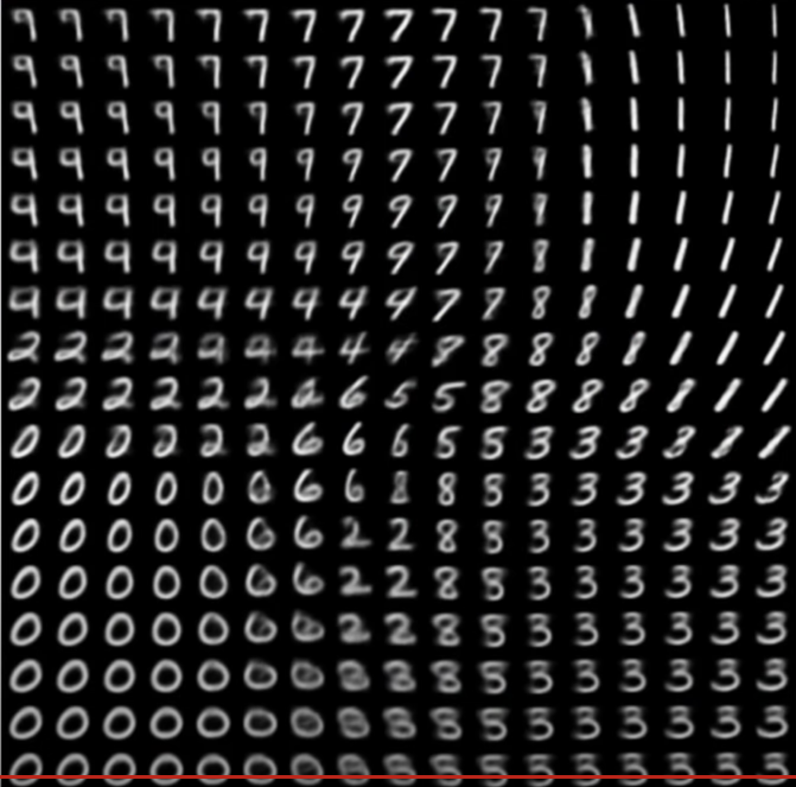

# Machine learning notes

gradient is another word for slope, the higher the gradient the steeper the line at a point ie the higher the slope, negative gradietn means that the slope is negative.
Oh and the derivative is the slope, like the derivatie is a way of obtaining the slope.

## Glossary
- NN = neural network

### Random Basic stuff

 *https://colab.research.google.com/github/tensorflow/examples/blob/master/courses/udacity_intro_to_tensorflow_for_deep_learning/l02c01_celsius_to_fahrenheit.ipynb#scrollTo=m8YQN1H41L-Y*

  

*backpropgation https://classroom.udacity.com/courses/ud187/lessons/e0c70c77-5584-4f83-a47b-a67a6172ae75/concepts/ac6c6991-8096-4c7a-bad1-706f7e3d36f1*

### Gradient descent

The following screenshot is taken from MIT intro to deep learning course https://github.com/aamini/introtodeeplearning/blob/master/lab1/solutions/Part1_TensorFlow_Solution.ipynb

 

 

------------------------------------

### Gradient tape
When u do backpropagation you need your previously computed gradeints. we can store them one by one, but a neater way of doing it is useing gradient tape, which stores it and then when it is time to backprop it "pops" the gradients we previously computed. it is like a tape record but for gradients. Stack over flow says _"to back propagate errors, you have to keep track of the gradients of your computation and then apply these gradients to an optimiser."_ https://stackoverflow.com/questions/53953099/what-is-the-purpose-of-the-tensorflow-gradient-tape

### Variational Autoencoders
Notes I referenced: https://www.youtube.com/watch?v=9zKuYvjFFS8 , and this but the 2019 version https://www.youtube.com/watch?v=rZufA635dq4&t=67s 

 - _Autoencoder_ is a compression unsupervised neural net, it takes ur data and tried to 'compress' or express it in as little space as possible. The compressed version of the data describes the entire un-compressed piece of data, and it is possible to derive back the orignal piece of data from the encoded or compressed data. The compressed version of the data is called __latent variable__.
  
    For example a 1280 x 720 cat image can be described by a 10d latent vector or 10 latent vars (arbitrary numbers not actual results). 
  
    - The latenet vector/variable can be de-encoded or de-compressed to get the orginakl image, the image will not be teh exact same, and we can do pixel by pixel comparission to compute the compression loss, and from there we can train a better compression neural net
     
   - The more latent vars we use the sharper and the more details will be obtained from the de-compression
   - By feeding the encoder step noisy images as inputs, you can force the decoder to remove the noise from the images and obtain the actual images before u added the noise to them, so in otherwords you can create a _noise removing neural net or de-noising autoencoder_   *ypu train the model with the bottom noisy images and train it to produce the top clean ones https://youtu.be/r0Ogt-q956I?t=9903*
   - _Neural Impaiting_ is when u crop out a part of the input image, feed it to the encoder step and have the decoder comeup with the part that you cropped, this can be used to remove either watermarks or even remove objects in video footage

*An Autoencoder. Left side: encoding step. Right side: decoding step
https://mc.ai/auto-encoder-in-biology/*

 

- Variational Autoencoders 
    --
    - Are the same as autoencoders, but instead of a fixed latent vector, we have a probablistic layer with the mean and standard deviation that then feeds into the latent vector
    -  *https://lilianweng.github.io/lil-log/2018/08/12/from-autoencoder-to-beta-vae.html*
    - The sameples latent vector takes a sample from the prob distribution and then feeds that to the decoder. U can't do backprobagation with the sampling node since the sample from the distribution can be different. So we resort to a reparamtrization trick to enable us to train the NN end to end
    - If you run the same image thru a VAE you're going to get a different "latent representation" every time. meaning that everytime you decode it you will get new images, which are generated images!
    - 
    - *mnist numbers set with 2 latent vars https://youtu.be/r0Ogt-q956I?t=9796*
    - This images is only 2d because of us only using two latent variables, but if we use x-latent vars then we'll get x-dimintional representation, which is very nicely seperated.
    - If we pass the data in the above image to the decoder we get the following generated brand new mnist data
    - *https://youtu.be/r0Ogt-q956I?t=9821*

### Misc
- model = neural net
- Kernal = weights 
- tensor = an array or a matrix of any dimention
- 1d tensor = an array , 2d matrix = each element in the first array is an array. Ie a matrix , think of it that u hv to dive to arrays to get actual numbers.
 3d tensor = numbers in an array, in an array, in another array for a total of 3 arrays deep till u get to the numbers.
- ## CNN can do everything RNN can but better! https://youtu.be/r0Ogt-q956I?t=10499
- logit values are what softmax takes as inputs, it then outputs probabilites

 ### note
speedy notes, pardon the mad typos!
