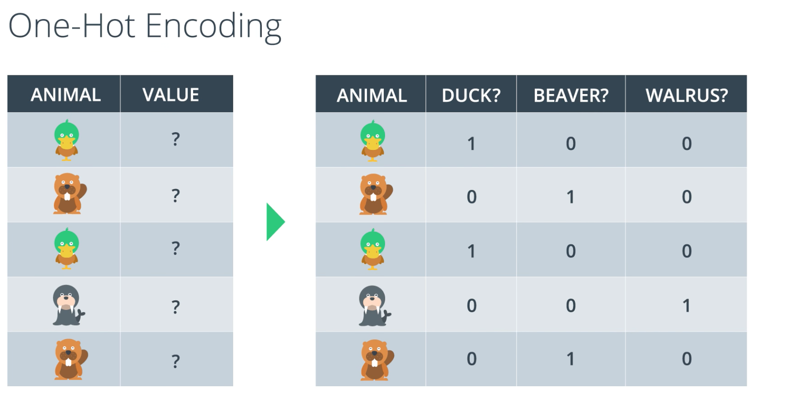
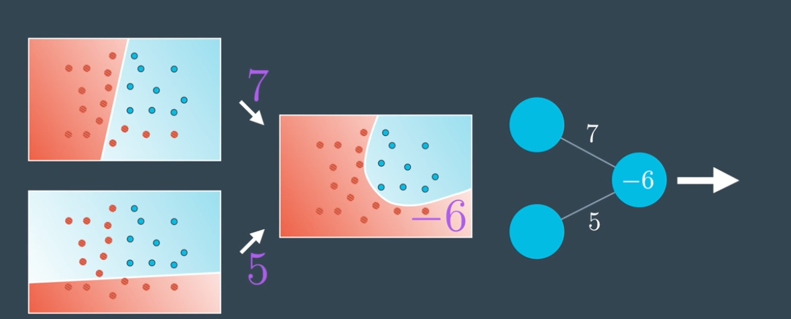
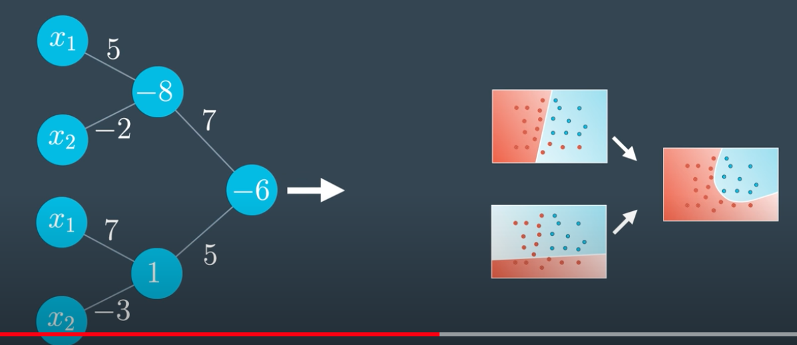
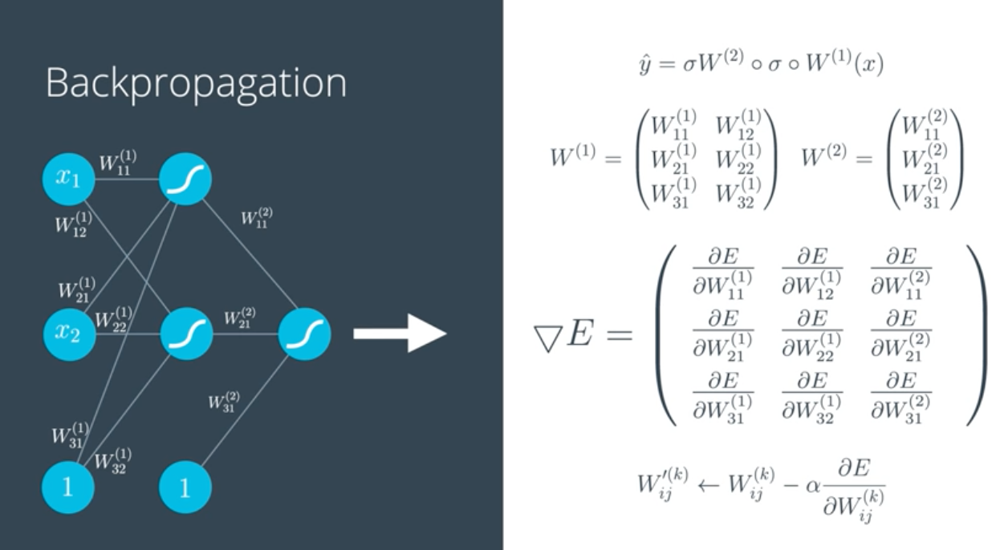

# udacity pytorch course notes

https://classroom.udacity.com/courses/ud188/lessons/b4ca7aaa-b346-43b1-ae7d-20d27b2eab65/concepts/6ba9c9eb-2e36-4b03-9bcc-01e71260a024

## Lesson 2

The preseptron has the graph functino inside it, and the weights are just the linear function coefficients, the preceptron outputs a boolean 

_Gradient descent_ is like being on top of a mount Errorist, and the hight you are in is the amount of error, you try to find a path that will reduce the hight, so you take a step in the direction the lowers the hight and you keep doing that until you're at the lowest possible place. 
GD works best with continous error, so you gotta define the error functino to output a continours value (like distance in a line), instead of a discrete one (like true or false).

Changing to continous can be done by changing the activatino functino from step func to sigmoid

btw the step activatino functino can be used if we want to make logic gates (AND, OR, XOR ...etc)

 

Notice how the probability always adds up to 1

cross entropy is to use log to turn multiplications into additinos, which are easier on CPU, the lowerst entropy means that the higher the propbability, so the less the entropy the better the model is.

Cross entropy mathmatically can tell us how similar to vectors are. If CE is low then the vecotrs are similar, if CE is high then the vectors are very different 

Exponent function is always positive, and Log functino can turn multiplications to additions thus making our work more efficient since multiplications are more expensive

* When traininig the model, the first "model" or weights are random, ML then uses gradient descent iteration to minimize the error **It is possible to get different training outcome each time you train!!** this is becaue the random initial placement of the weights plays some role.
  * Here is the same exact experiment, after each training we get a different result    

* The difference btwn Gradient descent and preceptron algs is that GD gives us a number between 0 and 1 (analog) while the preceptron gives us a discrete 0 or 1 
      .
     That line is the model 
     Takes a point (x1, x2) and returns a probability of the line being correctly classified (how far into the blue region) 

## Nerual Network Architecture
The power of nerual networks (or multilayer preceptrons) come from their ability to deal with none linear data, so far our model was a stright line but what if it was a more complex shape?

* A complex thing is just putting more of simple things together, so to solve it we use many simple things together! We will use our simple linear model from before, only this time we will use more than one, then add them, and finally to get a probability between 0 and 1 we will use a sigmoid.
* We can control the output model by giving different weights to the indivitual models 
* The indivisual models are just a linear combination of the inputs times the weights plus a bias, and the output is just a linear combination of the previous models times the weights plus a bias
 

 * using preceptrons, the 7 and 5 are the weights we assigned to each model  
 *  breaking it down
 *  
  
* Cleaning up and joining them
    
    

    Using a different notation to present it 

 
 General architecture is 1. input layer, 2. many linear hidden layers (can also be nonlinear hidden layers), 3. an output layer which is just the combination of previous linear layers to create a final non linear layer

* If we have N inputs then we have N diminetion models

* This is for a multilclassification problem
  

* We can use nonlinear models as inputs to create an output nonlinear model!  
  

Error function for one perceptron

For multilayer perceptorn error is still the same since it is just a measure of how wrong a point is classified, but the predictino or y_hat is bit more complicated since it is a linear combi of sigmoids and weights npw 

Feedforward is the pass from inputs to output probability prediction, we use that prediction to get an error. Now if we want to correct for that error we use Backpropacation.

---

### Math that you can ignore

---
---
---

Simple models tend to be better since they less prone to overfitting compared to complicated models

To fight overfitting we punish large weights useing one of two regularization functinos in the error function, by adding values that become bigger as weights get bigger, we have two reg functions L1 using sum of abs, and L2 using sum of squares

* To combat local minima in gradient decent one way is to start at different poinsts in the gradient and see which one is the global lowest

