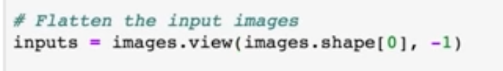
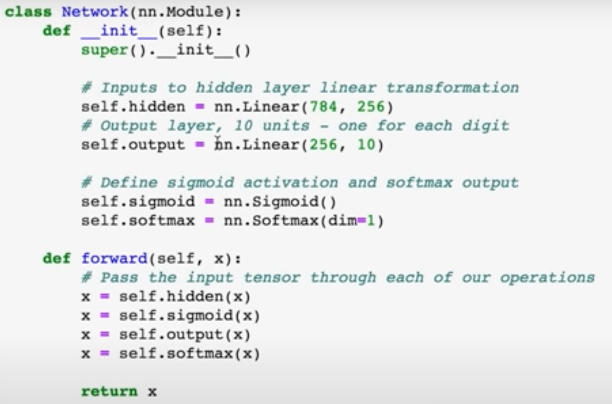
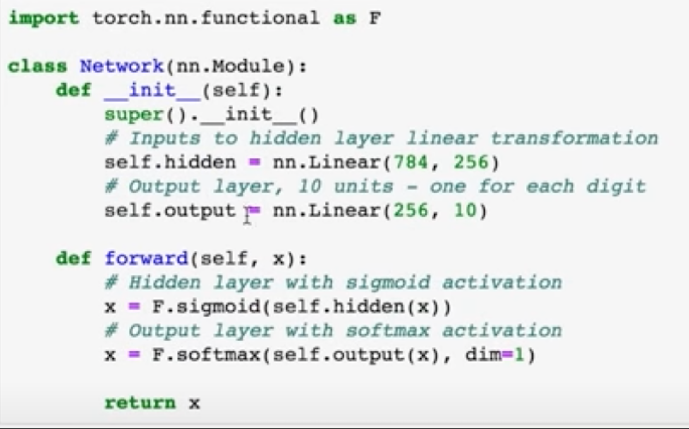
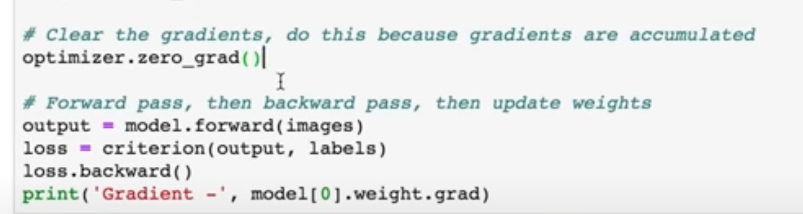

https://classroom.udacity.com/courses/ud188/lessons/c5706f76-0e30-4b48-b74e-c19fafc33a75/concepts/4e645270-9102-4683-b1b9-a2376e68f10d


- A tensor is a fancy word for array, or an array in an array.
 1d tensor is an array
 2d tensor is a 2d array, ie matrix, or an array in an array
 3d tensor is a 3d array, ie an array in an array in array like this [. [ . [ . ] ] ]

 - To change tensor shape, tensor.view() functino doesn't change the memroy, it just changes the shapr or the way you view of the tensor in memory, which is the most efficient way. tensor.reshape() is a mix and can give unpredictable resutls because it sometimes it copies the data and creates a new memory location which is not as efficient as tensor.view
 - you can move tensors from pytorch to numpy and vice versa, if u change tensors in place it will change the tensor for both because both torch and numpy will use the same memroy space.
 - The negative one is a shortcut to flatten the tensor 

- ReLU is the fastest activation function for training.
- Using functional is easier in pytorch, here is with and without  
- When we train in pytorcch we gotta always set our gradients to zero as they accumulate 
- Three ways to define a deep NN in pytorch
``` python

num_output = 10
size_input = 28 * 28
size_middle_layer = size_input // 2 # this is arbitrary
# 3 ways to define the same modle
### way 1
from torch import nn
class Classifier_1(nn.Module):
    def __init__(self):
        super().__init__()
        self.hidden = nn.Linear(size_input, size_middle_layer)
        self.output = nn.Linear(size_middle_layer, num_output)
        self.relu = nn.ReLU()
        self.sotmax = nn.Softmax(dim = 1)
    def forward(self, x):
        x = self.hidden(x)
        x = self.relu(x)
        x = self.output(x)
        x = self.softmax(x)
        return x

model_1 =  Classifier_1()

### way 2 (shortcut from way 1)
import torch.nn.functional as F
class Classifier_2(nn.Module):
    def __init__(self):
        super().__init__()
        self.hidden = nn.Linear(size_input, size_middle_layer)
        self.output = nn.Linear(size_middle_layer, num_output)

    def forward(self, x):
        x = F.ReLU(self.hidden(x))
        x = F.softmax(self.output(x), dim = 1)
        return x
model_2 =  Classifier_2()


### way 3

model_3 = nn.Sequential(nn.Linear(size_input, size_middle_layer),
                        nn.ReLU(),
                        nn.Linear(size_middle_layer, num_output),
                        nn.Softmax(dim=1)
                        )


```

- Adam optimizer is the same as SGD, only that it has momentum and learning rate adjustment
- When we train we want to use dropouts, when we inference we dont use dropouts so during inference we use the `model.eval()` when skips the dropout layers defined for training
- when picking a pretrained model there's a trade-off, the number of layers means that the model will be more accurate, but it will be bigger and could take more time to compute. Usually the numbers suffeixed to the name of the pre-trained models corrospond to the num of layers, for example RES-19 or RES-50 for resnet pretrained model
- All of our tensors are sitting in the memory for use in the CPU, which is not as fast as a GPU. To use the GPU first load your tensors into the GPU memory by running `model.cuda()`. You also have to load your training data tensors into the GPU `images.cuda()` and to move them back from the GPU to the cpu space use `model.cpu()` and `images.cpu()`

---

