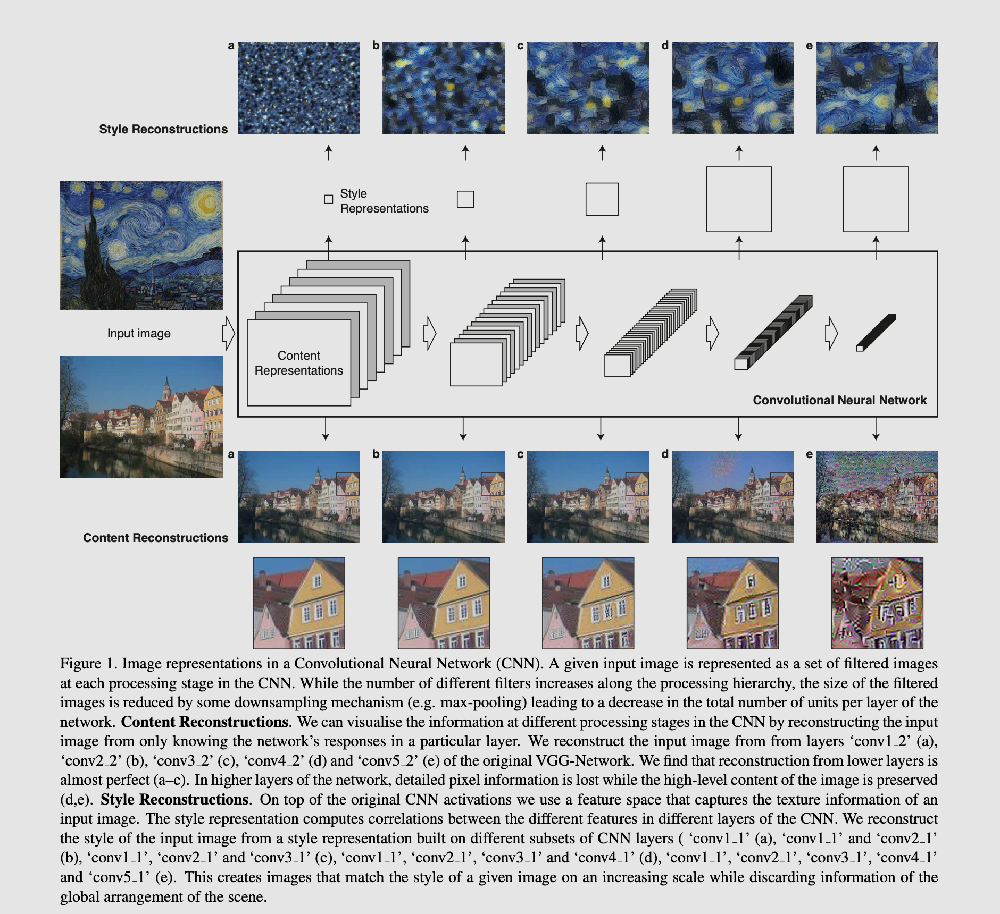

# Lesson6 Style transfer

We extract content from an image, and apply the style of another image and put them together ot produce the new stylized image. 

Using CNN we can extract the content or "features" of an image, and we also use CNN to extract "style" of another image. and then we generate a new image based on the two criteria we extracted from both the content image and style image.

using CNN layers filters increase as we go deeper in the network, and the deeper the layer the more "higher level" representation of the image we get, so the deepr the network the less exact the pixel values are, ie the more abstract. We cam __reconstruct the original__ image by taking a layer's response to a certian network image input. in higher level layers we see that exact pixels are lost but we maintain the overal "content", by taking the layer response from lower layers (say first conv layer) we get an almost exact image of the input so no change. 

depth means how many filters we have. filters are also called feature maps.
Lower layers like conv1 have the biggest layer size, and as we go down the network maxpooling downsamples the the layer size so at the end we have a reduced size.

 

We use a pretrained image classification network, VGG19. We can take the CNN feature extracting layers and remove the classification dense layers, this way we can use the CNN layers to extract style and content.

In VGG19 There are stacks of two or four CNNs followed by max pooling layers. The number of filters increase with every CNN stack

The deepeset CNN in the network is conv5_4. The deeper the layer means that the image we extract from it will be a high level represntation of the features of the input image

We take the content representation from a deep layer, this way we get a content representation or a "high level feature map or filter" that represents the image. The deeper the layer we take the output from the more we discard exact pixel values and focus on the high level content.

We extract style by adding layer responses from multiple CNN layers to create a "style map". The more CNN layers outputs we add the stronger the style map is. 

This is a very useful explaniation from the research paper https://www.cv-foundation.org/openaccess/content_cvpr_2016/papers/Gatys_Image_Style_Transfer_CVPR_2016_paper.pdf

How do we take the style map and the content and mix them to create a new image?
we take a starting image, either a white image (with white noise) or the actual content image input ,and then manipulate the start image using the content rep and style maps that we extracted with CNNs until we get something we're happy with.

We use the content represnetaion we got from the network and create a stylized image which we compare with the input content image and define _content loss_ or how different the stylized output image is from the actual content image. The stylized img should be close to the content image. 

Cc is contnet from content image, and Tc is content from target image(output stylized image)
We define content loss as the mean square difference between the two

and it measures how far away the content rep is from the content image.

Now this content loss tells us how close we're to the original image, the bigger the loss means that the stylized image or the content rep is not similar to the content image.  We can use this loss to get the best stylized image and make it as close as possible to the original content image. We keep change Tc until we're happy with the loss.

We use VGG as a feature extracter and backpropagation to minimize for the content loss, we're not actually training the VGG we are just using it as a feature extracctor  

---

How so we represent the style of an image?

We compute corrilations(similarites) between differeent filter responses in a single layer across the different CNN layers, in other words looking at how similar the features in a single layer are. These feature correlations are given in the gram marix.

Say we start by a 4x4 image matrix and we convolve it with a CNN layer with 8 filters. We get a 4x4x8 ie 8 feature maps that we want to find the relationships between (correlations).

we flatten the 4x4x8 and turn it from 3d to a 2d
- 
- next we multipy the 2d feature maps by the transpose to get the gram matrix, this operation treats each value in a feature map (filter) as an indivisual sample unrelated in space to other values. The resulting gram matrix has non-localized information about the layer. which is information that will still be there even if an image was shuffled in space, so even if the actual content was unidentifiable we should still be able to see the color and textures ie the style.
- The Gram matrix is just one mathmatical way of representing common styles in the featuure maps, there are others. Style is an abstract idea and can be represented a number of different ways.
- 
- 
- 
- The gram matrix will be a square matrix of dimintions 8x8 or num_features by num_fearues ie layer depth

Now we need to get a style loss between the output image(target image) and the style image, we use the mean squared distance between the gram matices of the target image and the styl image. We will have 5 pairs of gram matrices computed from conv1_1 all the way to conv5_5

Ts is target style loss and Ss is the style image style loss. W is style weights that we specify. We only change Ts to get the loss we want

Now we have total loss, which is value we can use to optimize and interitivly train the network.

Since the style loss is much larget than content loss we use weights to make then be compareable and to help us  regard them equally  

playingw with this ratio can change the output target image 

