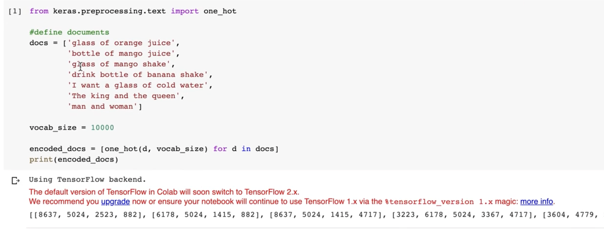
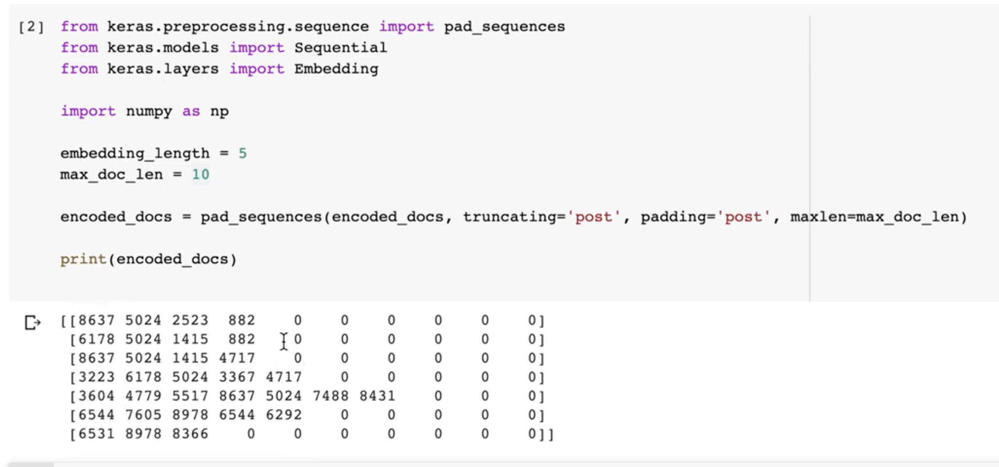
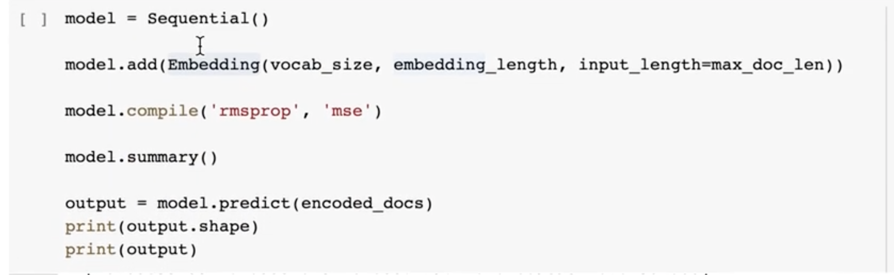
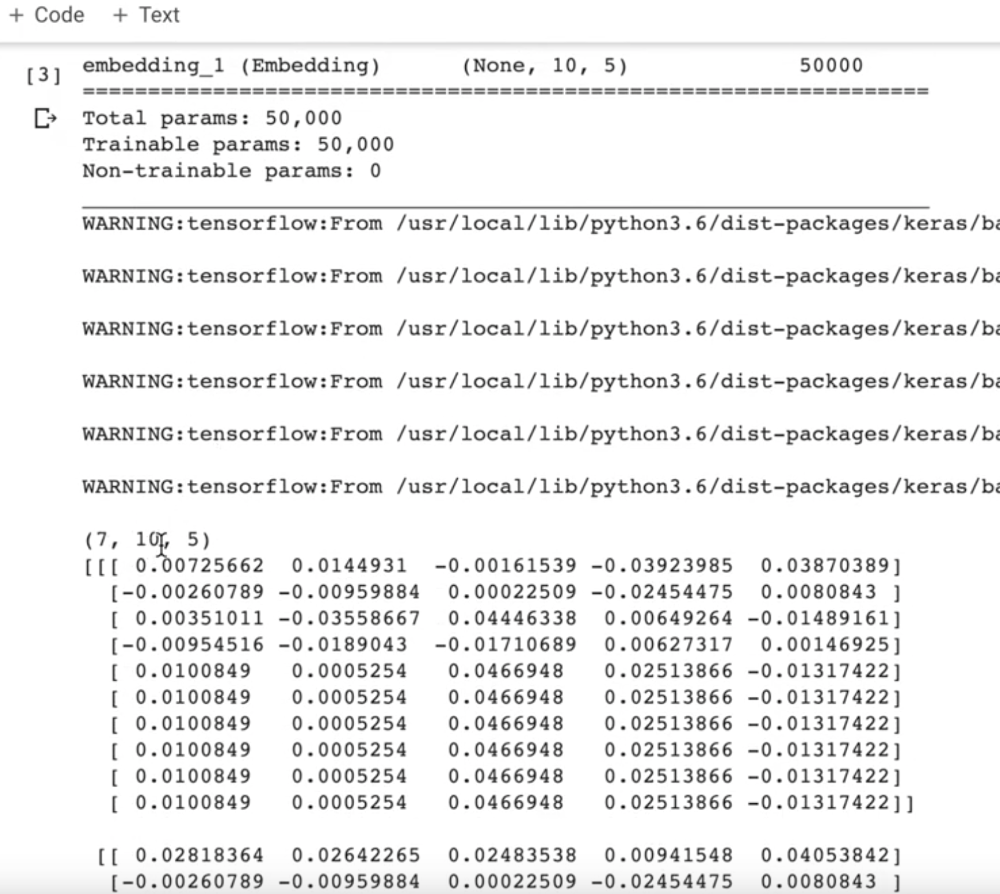
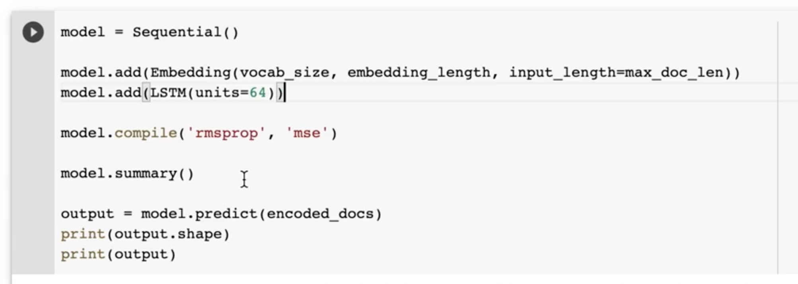
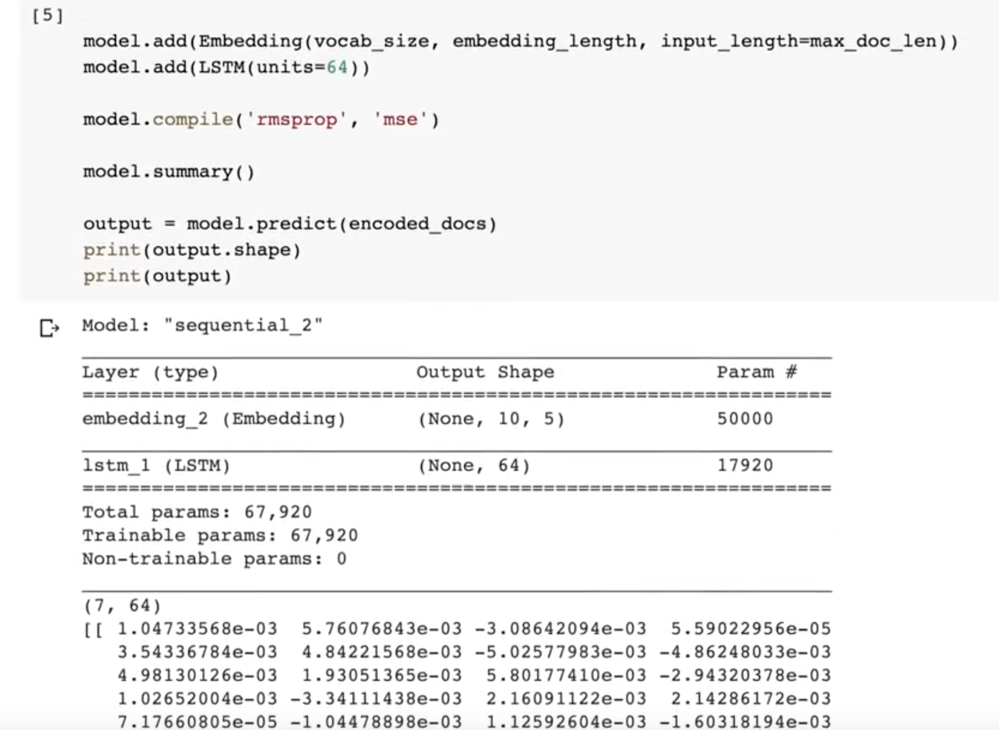

# Embedding

We want to represent text as integers so out ML can read it.

we can use one hot encoding, but then  the matrix will be HUGE depending on how many dimentions you have.
So we use an embedding layer. An embedding layer trains with your model it basically finds relationships in your data words that are related to each other will be encoded as vecotors that are closer to each other in the 3d space.

It is recommended to use Embedding layer whenever you use an RNN even if it is not encoding text, it is perfered over one hot encoding becasuse it acheives way better results, and the embedding layer can be saved an used in other models that are related. The embedding layer takes the number of unique tokens plus 1, always plus 1. and then it takes the output dimensions, which is somewhat arbitary. the output dimention is a hyper parameter that can have a big sway in the final accuarcy of the model.

`model.add(Embedding(num_unique_tokens+1, output_dimintion))`

Lets take an example from IMDB dataset, say we are considering 7 reviews, where the max_word_length is 10.

One review is called a *Sequence* which is a list of words where every word is called a *Timestep* in IMDB every time step is just an integer which maps to a word in the review. We limit reviews to a max of 10 timesteps in our example. The Embedding layer will take every timestep and convert it into a vector(list) of length `output dimintion` aka embedding length. So the embedding layer is like:

`Embedding(max_words, embedding_length, input_length=max_word_length)` where max_words is the maximum vocab size, embedding_length is the output dimention, and max_word_length is the maximum length of one review, ie the max timesteps found in one sequence. We use padding and truncating to enforce this limit. Ofcourse there are ways to sidestep using fixed input size, but the simpile way is to enforce a limit.

The example is coded below, code taken from youtube video linked here https://youtu.be/CcGf_Uo7NMw?list=TLPQMTIwOTIwMjGMrZR86wu91w

The output shape of the embnedding as we see is (7 reviews, 10 timesteps per review, 5 embedding length)

if we add an LSTM it will take the input shape of (7, 10, 5) and output 7 x units_num 

since we have 64 units the output of the LSTM will be one hidden state per unit per input sequence, so output is (7, 64)

Meaning every review got converted into a list of 64 elements (floats) and since we have 7 reviews we have 7 of those float lists