# LSTM => Long Short Term Memory

https://youtu.be/7nnSjZBJVDs?list=PLQflnv_s49v_i1OVqE0DENBk-QJt9THjE&t=707

An RNN is good at handeling sequences, say you have a sequence of words (the weather is nice) and a train of 4 RNN "cells" where the each cell has a hidden state that we first initalize randomly. Each cell takes a word as input (the->cell1, weather->cell2 ...)  but each cell also takes the previous cell's hidden state as input too! and as the model trains on many different sentences we update those hidden states. 

The default RNN layer is to return the final hidden state for every RNN cell, or if you're batching your data the output is (batch_size, num_cells).

We can make the RNN return the hidden state of every input word instead of just the last one by using the argument `return_sequence=True`

RNN cells also have an internal state, that is used inside the cell. It is not usually useful unless you want to retain the internal state for use in resumeing training later, or if you want to train another RNN, this is usually used for encoder/decoder models where you return the state of the encoder and feed that state to the decoder. U can return the state using `return_state=True`

#### LSTMs are great at sequences but they are very sensitive to the initial random weight initalization, you may find "swings" in accuracy every time you initalize the random weights(states) of the LSTM thats why it is worth it to save the best weights you start out with

the LSTM is a type of RNN that "solves" the vanishing gradient problem, which is that the model forgets training data that is not recent ie it "vanishes" LSTM introduces a memory component to address this problem.

An LSTM needs 3 dimintion input

- from one website explanation

    LSTM expects input data to be a 3D tensor such that:
    [batch_size, timesteps, feature]
    batch_size how many samples in each batch during training and testing
    timesteps means how many values exist in a sequence. For example in [4, 7, 8, 4] there are 4 timesteps
    features: how many dimensions are used to represent a data in one time step. For example, if each value in the sequence is one hot encoded with 9 zero and 1 one then feature is 10
    Example:
    In raw format:
    X=[4, 7, 8, 4]
    In one hot encoded format with 10 dimensions (feature = 10):
    X=[[0 0 0 0 1 0 0 0 0 0]
    [0 0 0 0 0 0 0 1 0 0]
    [0 0 0 0 0 0 0 0 1 0]
    [0 0 0 0 1 0 0 0 0 0]]

- from another site

    *Samples*. One complete sequence is considered as one sample. A batch may contains one or more samples. In NLP, if we are dealing with the text at sentence level (means taking one sentence at a time), then our sample size will be one.
    *Time Steps*. It can be considered as the number of times, we feed to the model. In the above discussed one-sentence case of NLP, the number of words in the sentence will be equivalent to the time-steps.
    *Features*. It represents the number of columns of each sample. In the above one sentence case of NLP, we will obtain it through embedding. Generally, we use word2vec, Glove, etc. to get the word embeddings. Thus, in this case the dimension of the embedding will considered as feature size.

   Features is also the number of observations per timestep

Look at my python notebook lstm_inputShape.ipynb for better explanation

# Theory for 1 single LSTM cell

A simple LSTM cell takes sequential input where the cell takes one element at a time, and LSTM gives two main outputs ( we will talk about the other later):
 1. The Cell state
 2. The hidden state
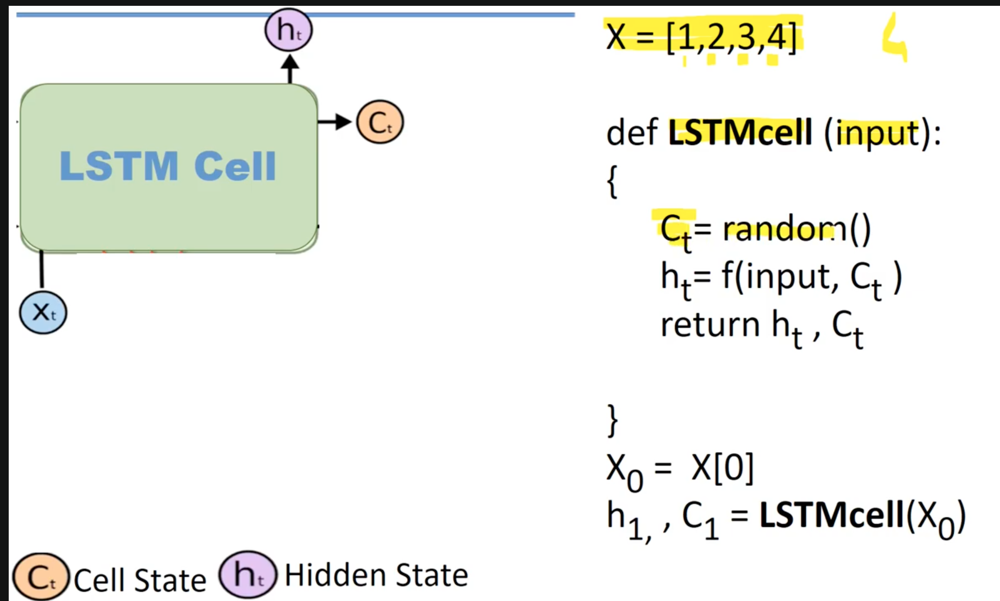

The above LSTM cell model is nice, but an LSTM layer calls the same LSTM cell many times, we have just one LSTM cell but it we keep calling the same LSTM cell for every element in the input sequence and it keeps updating the params in that cell, *one LSTM function-call for every element in the input sequence*, so we will have a cell state and a hidden state for every single element in the input sequence. The last cell state and hidden state are the ones that are going to be returned by the layer
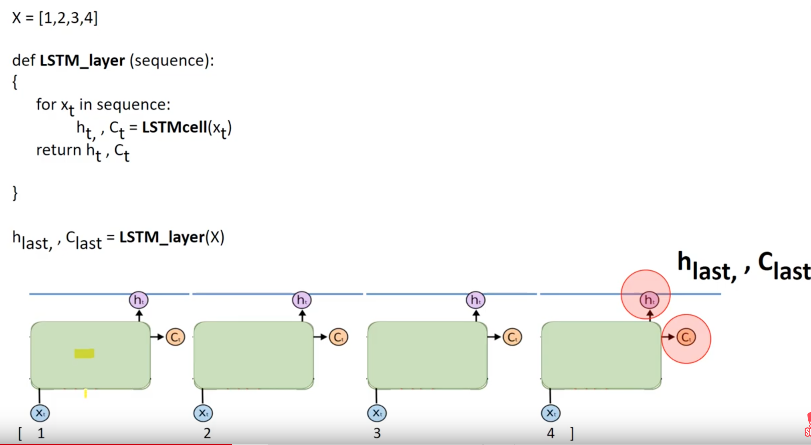

The above simple model is nice, but in reality LSTM has more inputs and outputs. A real LSTM has 3 inputs and 3 outputs.
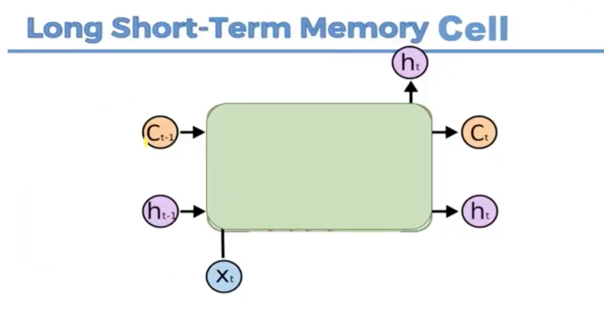.
The inputs are:
 1. inital cell state
 2. initial hidden state
 3. the input sequence

The inital states (states for the first cell) are randomly assigned, but for subsequenct cells these inputs are from the previous cell's calculations and NOT random.

LSTMs are drawn to appear to have many cells, but in reality it is *just one cell that keeps calling itself* while using previous states as inputs to the next call ie also have feedback loops

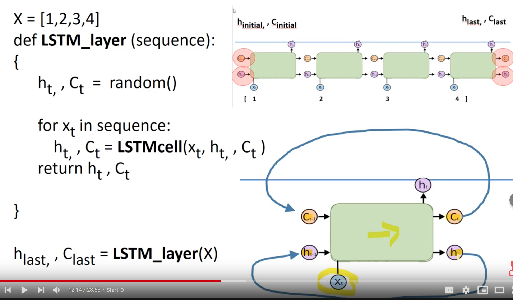

What about the output options:
1.  output only the last layer hidden state (output is a scaler)
    -  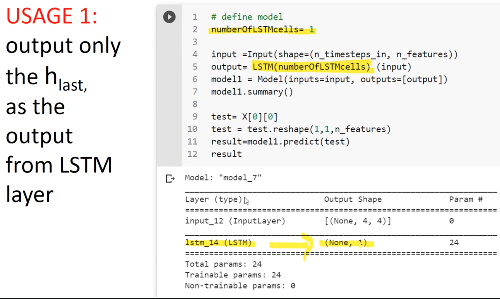
2. output all the hidden states from all of the LSTM cell calls (output is a vector the length of the input sequence)
   - 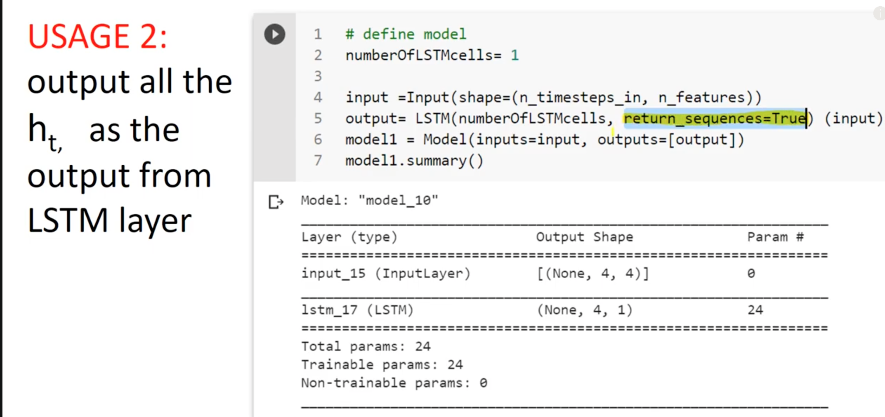
3. output all cell states and hidden states (output will be a vector whose elements are: the first 2 are the last cell and hidden states, the next element is the and the last output is a vector video didnt give a good explanation why the shape is 48 so research that if intrested )
	+ 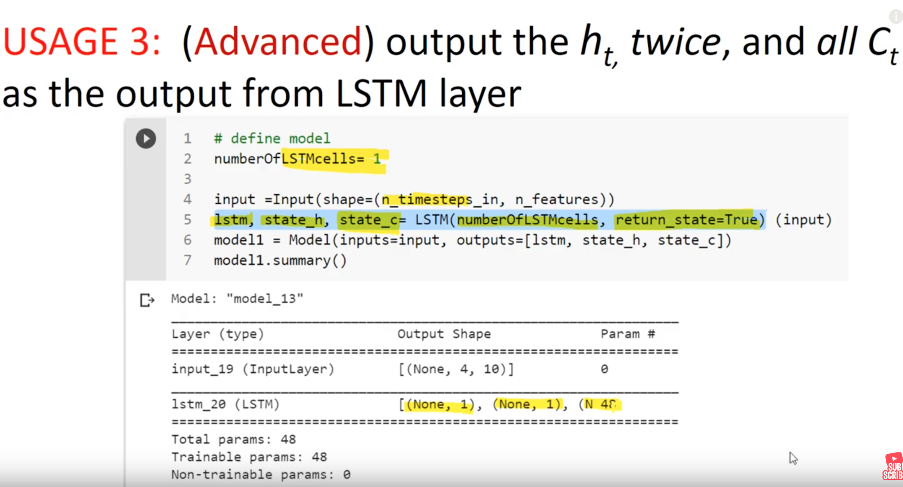

---

# Using multiple LSTM cells

Now in practice we can use 2 LSTM cells (each one takes a copy of the input) but there's no communication between them, since we have now two cells we will return 2 scaler values from the last hidden states
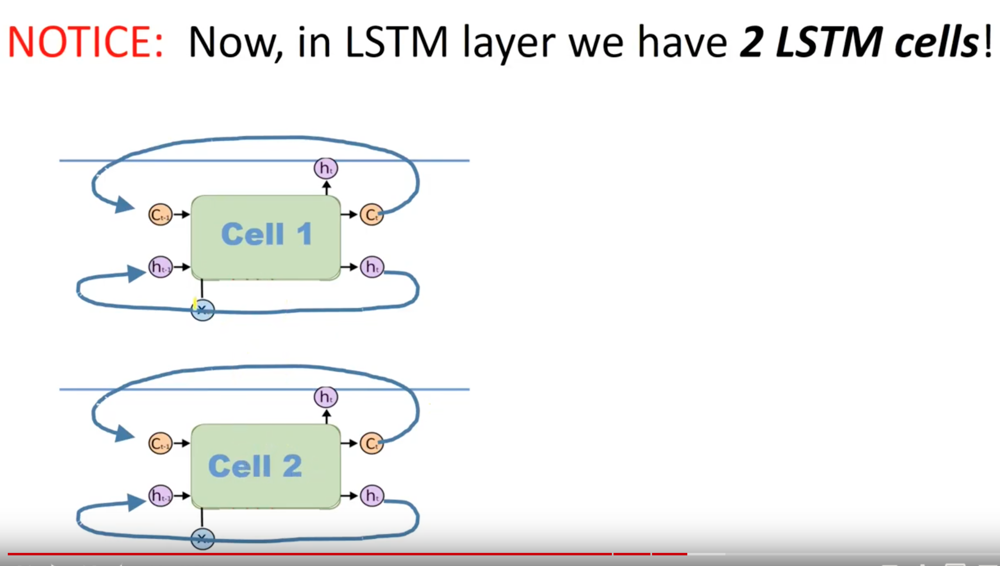
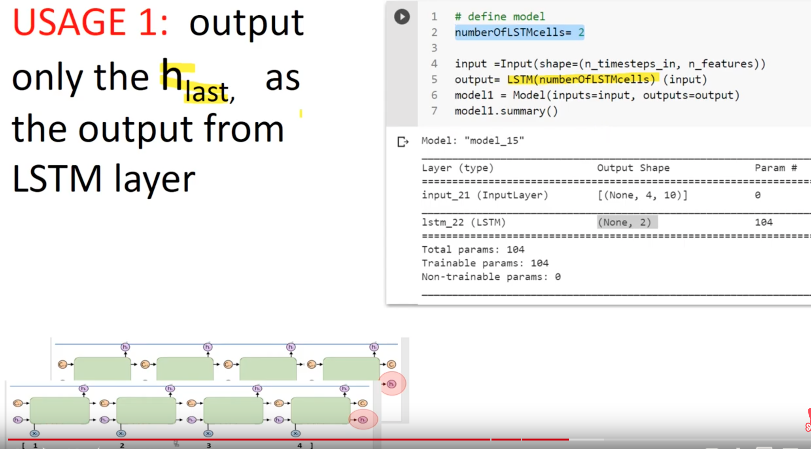

If we use 200 LSTM cells we're going to get 200 hidden states

If we make return_sequence=True
   - 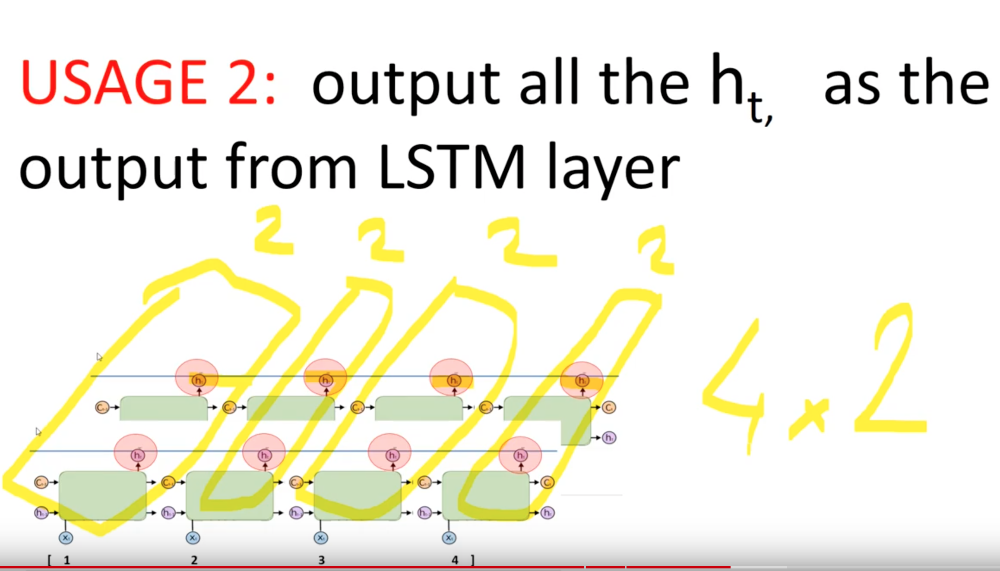
   - 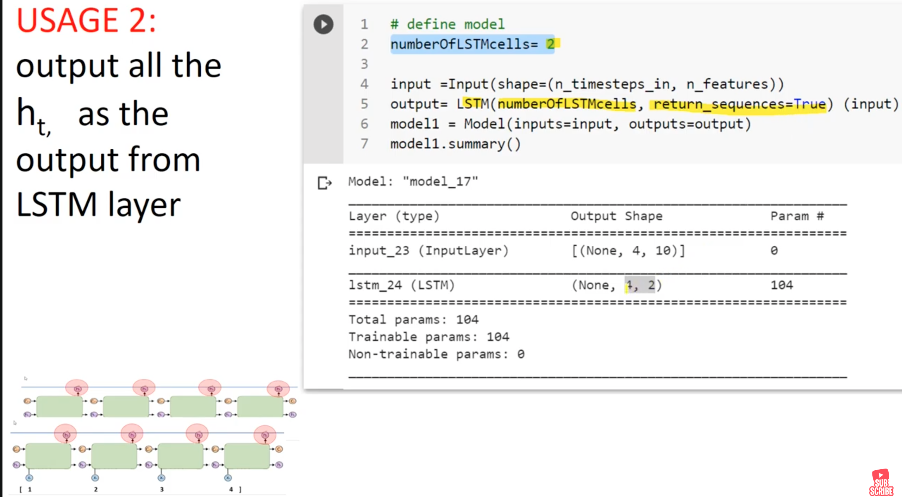

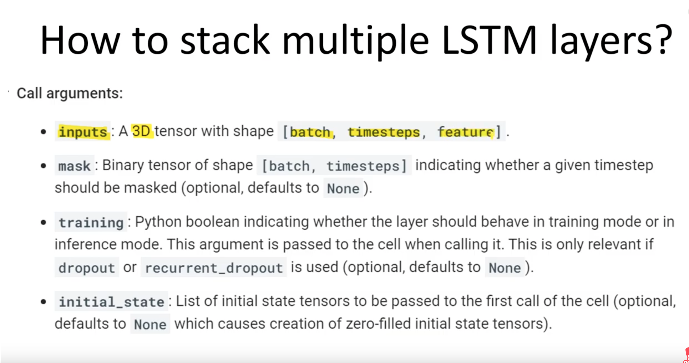

To use multiple LSTM layers we need to replicate our input to the number of layers
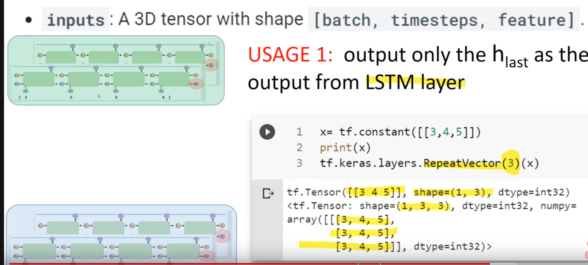
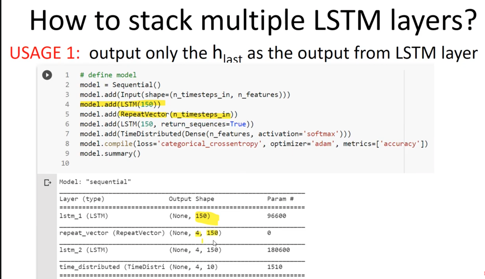

units is how many LSTM cell calls we have, return sequ is if we want to return the hidden state of every layer, return_state should research more.

The videos's notebook example for LSTM is called 'LSTM_Intro_Youtube.ipynb'

