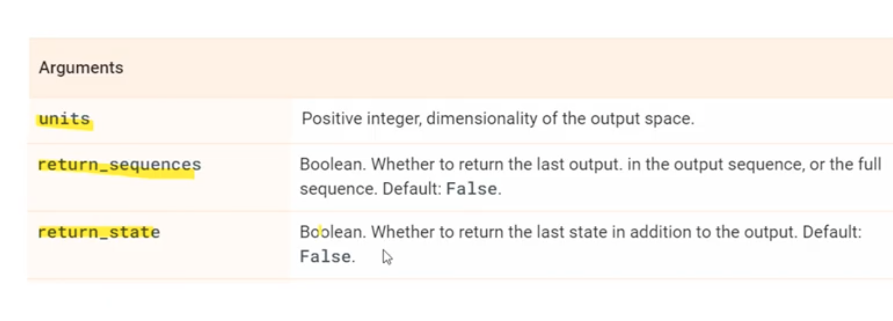

# LSTM => Long Short Term Memory

https://youtu.be/7nnSjZBJVDs?list=PLQflnv_s49v_i1OVqE0DENBk-QJt9THjE&t=707

the LSTM is a type of RNN that "solves" the vanishing gradient problem, which is that the model forgets training data that is not recent ie it "vanishes" LSTM introduces a memory component to address this problem.

# Theory for 1 single LSTM cell

A simple LSTM cell takes sequential input where the cell takes one element at a time, and LSTM gives two main outputs ( we will talk about the other later):
 1. The Cell state
 2. The hidden state

The above LSTM cell model is nice, but an LSTM layer calls the same LSTM cell many times, we have just one LSTM cell but it we keep calling the same LSTM cell for every element in the input sequence and it keeps updating the params in that cell, *one LSTM function-call for every element in the input sequence*, so we will have a cell state and a hidden state for every single element in the input sequence. The last cell state and hidden state are the ones that are going to be returned by the layer

The above simple model is nice, but in reality LSTM has more inputs and outputs. A real LSTM has 3 inputs and 3 outputs.
.
The inputs are:
 1. inital cell state
 2. initial hidden state
 3. the input sequence

The inital states (states for the first cell) are randomly assigned, but for subsequenct cells these inputs are from the previous cell's calculations and NOT random.

LSTMs are drawn to appear to have many cells, but in reality it is *just one cell that keeps calling itself* while using previous states as inputs to the next call ie also have feedback loops

What about the output options:
1.  output only the last layer hidden state (output is a scaler)
    -  
2. output all the hidden states from all of the LSTM cell calls (output is a vector the length of the input sequence)
   - 
3. output all cell states and hidden states (output will be a vector whose elements are: the first 2 are the last cell and hidden states, the next element is the and the last output is a vector video didnt give a good explanation why the shape is 48 so research that if intrested )
	+ 

---

# Using multiple LSTM cells

Now in practice we can use 2 LSTM cells (each one takes a copy of the input) but there's no communication between them, since we have now two cells we will return 2 scaler values from the last hidden states

If we use 200 LSTM cells we're going to get 200 hidden states

If we make return_sequence=True
   - 
   - 

To use multiple LSTM layers we need to replicate our input to the number of layers

units is how many LSTM cell calls we have, return sequ is if we want to return the hidden state of every layer, return_state should research more.

The videos's notebook example for LSTM is called 'LSTM_Intro_Youtube.ipynb'

