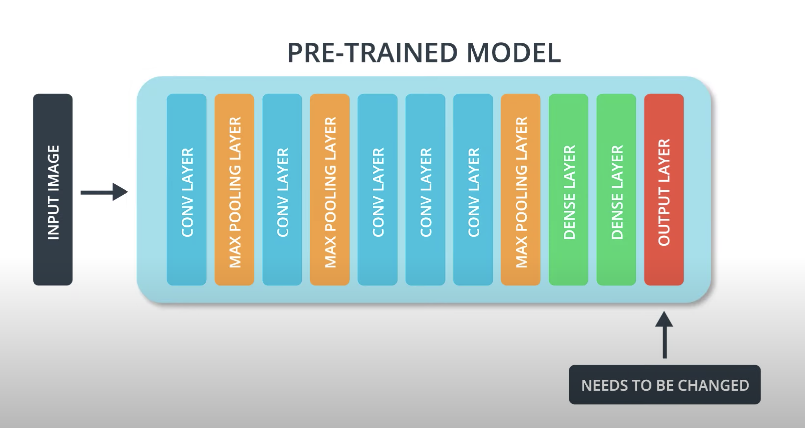
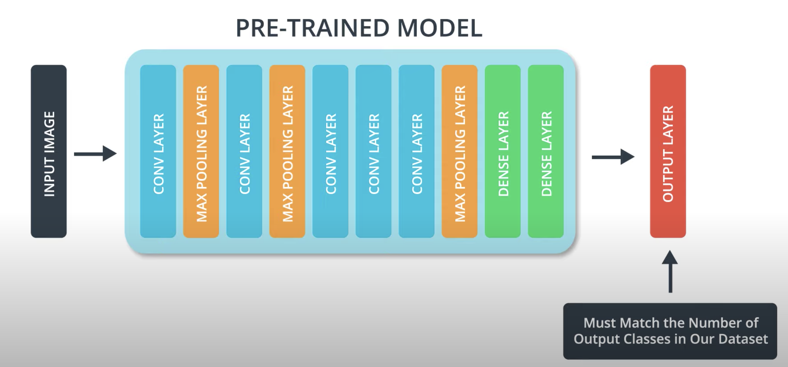
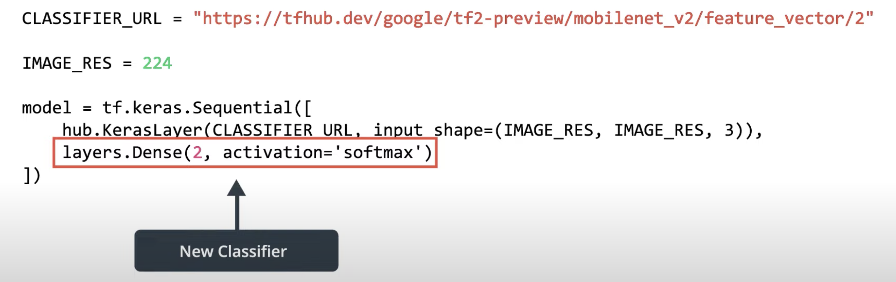

# Transfer learing

Is when you take a pre-trained model and repurpose it to fit your own use case.
For example, you can take a famous model that's trained by experts on massive datasets that can classifiy 1000 classes and tweak it so it can classifiy 2 classes for our specific dataset, cats and dogs.

Using a pretrained model yeilds much faster and "better" results then training a fresh neural net (model).

Part of the tweaking is changing the output layer of the trained model so that it fits our desired output.
 *https://youtu.be/JhR1_WZCj54?t=73*
 *https://youtu.be/JhR1_WZCj54?t=98*

To do that, we have to "freeze" the learning parameters of the pre-trained model except for the last layer (output layer) during training so we don't change the features learned by the pre-trained model. In other words, we're only training the last layer, and the rest we're coping from the pre-trained model. 

You can download pretrained models and use them in your main model, the pretrained model can be used as a layer in your model, just make sure to use the same image size used in the pre-trained model. You can find pre-trained models in tensorflow hub where the __LAST CLASSIFICATION LAYER IS REMOVED FOR U__ yaay!

 *https://youtu.be/l4-NTkEB8sk?t=178*
